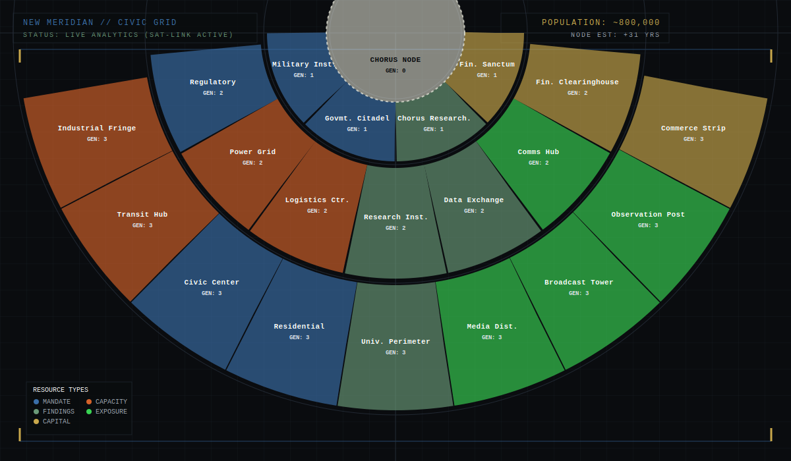

# 01 — Game Board: New Meridian
## THE SIGNAL P1 — Paper Prototype

**Version:** 2.2 — S90 (§4 Narrative Function and §6 Physical Forms migrated to Art 02; geography/zone-only). S114 (agy): DB-driven geography metadata blocks added, procedural content moved to Whiteboard — pending review and re-sign-off.  
**Status:** 🔄 Needs Re-Sign-Off  
**Depends on:** 00 — Factions, World & Narrative Context  
**Supersedes:** setup_guide (board sections), board_layout (visual reference only)

---

## 1. Overview

### Problem This Document Solves
The game operates across two distinct physical spaces: the shared table where all public information is displayed, and each faction's private zone where Terminal contents remain concealed. Without a fully specified layout for both, no other artifact can define where actions target, where resources generate, or how adjacency is calculated. This document defines the complete physical environment — every table zone and every district — in sufficient detail that visual design and database configuration can proceed without ambiguity.

### Deliverable
A complete specification of the physical game environment: the table zone structure (ARBITER area, faction areas, central play surface, and supply) and the district map (Ring 0 to 3). All dynamic component placement mapping is handled by [02___Components.md](file:///home/abosch/Projects/TheSignal/V1/02___Components.md) and all initialization states reside in [03-init___Game_Initialization.md](file:///home/abosch/Projects/TheSignal/V1/03-init___Game_Initialization.md).

### Success Criteria
- Any player can inspect the board layout and map boundaries to calculate adjacency relationships.
- The board's visual organization reflects the narrative geography of New Meridian — the Chorus Node at the top, the city spreading outward and downward.
- A visual designer can produce a complete layout wireframe from this document alone without ambiguity.

---

## 2. Index

1. [Overview](#1-overview)
2. [Index](#2-index)
3. [Game Purpose](#3-game-purpose)
4. [Narrative Function](#4-narrative-function)
5. [Design Principles](#5-design-principles)
6. [Physical Environment — Zones and Districts](#6-physical-environment-zones-and-districts)
   - [§6.1 Universal Schemas](#61-universal-schemas)
   - [§6.2 Zone Hierarchy Reference](#62-zone-hierarchy-reference)
   - [§6.3 Detailed Zone Specifications](#63-detailed-zone-specifications)
   - [§6.4 Detailed District Specifications](#64-detailed-district-specifications)
   - [§6.5 District Adjacency Map](#65-district-adjacency-map)
7. [Rules & Constraints](#7-rules-constraints)
8. [Starting Configuration](#8-starting-configuration)
9. [Faction Player Tableau](#9-faction-player-tableau)
10. [ARBITER Tableau](#10-arbiter-tableau)
11. [Special Conditions & Gameplay Impacts](#11-special-conditions-gameplay-impacts)
12. [Examples & Exceptions](#12-examples-exceptions)

---

## 3. Game Purpose

The board serves four simultaneous functions:

**Economic ledger:** All resource generation is readable from the district attributes. Presence levels, influence tiers, and structures together determine faction income each round, mapped to the static values defined in this geography.

**Territorial record:** The map coordinates and connections define the geography over which factions contest control.

**Information display:** The board provides the physical zones where shared tracks and decks are placed.

**Narrative stage:** The physical game table is a recreation of the actual setting where The Table convenes. Faction Representatives gather around the same surface that exists in the fiction: a private chamber at the Chorus Node, each seat corresponding to a player position, and the ARBITER Screen separating authority from process.

---

## 4. Narrative Function

The physical zones of New Meridian represent specific facilities, administrative regions, and networks that the factions contend for.

*Component narratives — District Tiles, Influence Level Marker, Tension Markers, Session Timeline, Initiative Strip, Chorus Activity Track, Accord Documents, Situation Reports, Reservoir, Backlog, Dispatch Tokens, Public Standing Track, Chorus Portrait Track — are in [02___Components.md](file:///home/abosch/Projects/TheSignal/V1/02___Components.md) §4.*

---

## 5. Design Principles

1. **Geography creates consequences.** A district's ring determines its resource generation value. A district's neighbors determine operational marker placement eligibility and battlefield strength calculations. Position on the map is never arbitrary.

2. **The center is always relevant.** The Chorus Node's strategic incentives ensure it remains a contested objective throughout the session, despite its lack of resource output.

3. **Rings are not equal.** Sprawl districts are accessible and low-value. Infrastructure districts are the economic engine of the mid-game. Core districts are high-value and require commitment to enter. This creates natural strategic progression across a session.

4. **Resource type is immediately readable.** Each resource type has a distinct background color applied to its district. A player can identify the resource type of any district across the table without reading text.

5. **The Terminal area is private.** What a Faction Representative holds, plans, and knows is concealed behind their Faction Screen. The board geography separates private player spaces from the public Central Area.

---

## 6. Physical Environment — Zones and Districts

*Zone diagram (Non-Canonical / Stale): P6 (ARBITER) at head of table; P1–P5 (Faction Players) arranged around remaining sides; Central Area at center; Game Box adjacent off-table; Chair 1–6 outside Table perimeter. Center table and supply zones are sketched but not canonical.*

*Center table wireframe (Non-Canonical): Illustrates detailed layout of subzones in the center table area (public tracks, ring deck locations, Broadcast Card placement area, reservoir, and backlog). P6 (ARBITER Area) subzones are stubs and pending design in Art 07.*

*District layout diagram: concentric Ring 0–3 geography mapping the 21 districts of New Meridian, overlaid with their spatial connections and boundaries.*

### 6.1 Universal Schemas

To maintain synchronization with `the_signal_db`, all physical areas (zones) and map regions (districts) are defined using standardized metadata schemas.

#### 6.1.1 Zone Schema
Feeds the `game_zones` database table.
* `db_id`: Integer (Primary Key)
* `zone_id`: String (Unique identifier, e.g. `zone_table`)
* `zone_name`: String (Display name)
* `parent_zone_id`: String (FK reference to parent `zone_id`, or `None` if root)
* `visibility`: Enum (`Public` | `Private` | `Mixed`)

#### 6.1.2 District Schema
Feeds the `district_metadata` database table.
* `db_id`: Integer (Primary Key, matches district number 1–21)
* `district_name`: String (Display name)
* `ring`: Enum (`Ring 0` | `Ring 1` | `Ring 2` | `Ring 3`)
* `resource_type`: Enum (`Mandate` | `Findings` | `Capital` | `Capacity` | `Exposure` | `None`)
* `base_generation_value`: Integer (Base resources produced per Quarter: 0 to 3)
* `hex_color`: String (Aesthetic CSS hex code, or `None` if N/A)

---

### 6.2 Zone Hierarchy Reference

| Zone | Parent | Description / Type |
|------|--------|---------------------|
| Game Box | None | Out of play component storage |
| Chairs | None | Seating positions outside Table perimeter |
| Table | None | Main playing surface |
| P1–P5 | Table | Faction player positions |
| P6 | Table | ARBITER area |
| Central Area | Table | Shared center play surface |
| Supply | Central Area | Shared supply zone |
| Accord Placement Area | Central Area | Shared active Accord documents zone |
| Session Timeline Area | Central Area | Timeline track zone |
| Initiative Strip Area | Central Area | Initiative Strip zone |
| Chorus Activity Track Area | Central Area | Chorus Activity Track zone |
| Situation Report Area | Central Area | Situation Report card zone |
| Public Standing Track Area | Central Area | Public Standing track zone |
| City | Central Area | Map region on the Overview |
| Ring 0 | City | Chorus Node ring |
| Ring 1 | City | Core ring |
| Ring 2 | City | The Mid ring |
| Ring 3 | City | Baryo ring |
| Ring 1 Modifier Area | Ring 1 | Modifier Deck zone for Ring 1 |
| Ring 2 Modifier Area | Ring 2 | Modifier Deck zone for Ring 2 |
| Ring 3 Modifier Area | Ring 3 | Modifier Deck zone for Ring 3 |

---

### 6.3 Detailed Zone Specifications

#### Game Box
* **Metadata:**
  | Field | Value |
  |-------|-------|
  | `db_id` | 1 |
  | `zone_id` | `zone_game_box` |
  | `zone_name` | Game Box |
  | `parent_zone_id` | `None` |
  | `visibility` | `Private` |

#### Chairs
* **Metadata:**
  | Field | Value |
  |-------|-------|
  | `db_id` | 2 |
  | `zone_id` | `zone_chairs` |
  | `zone_name` | Chairs |
  | `parent_zone_id` | `None` |
  | `visibility` | `Public` |
* **Description:** Represents seat positions Chair 1–6. Chair 6 is assigned to the ARBITER (P6); Chairs 1–5 correspond to Faction Players (P1–P5).

#### Table
* **Metadata:**
  | Field | Value |
  |-------|-------|
  | `db_id` | 3 |
  | `zone_id` | `zone_table` |
  | `zone_name` | Table |
  | `parent_zone_id` | `None` |
  | `visibility` | `Public` |
* **Description:** The physical table surface.

#### Faction Player Areas (P1–P5)
* **Metadata:**
  | Field | Value |
  |-------|-------|
  | `db_id` | 4 |
  | `zone_id` | `zone_p1_area` to `zone_p5_area` |
  | `zone_name` | Faction Player Areas |
  | `parent_zone_id` | `zone_table` |
  | `visibility` | `Mixed` |
* **Description:** Private and public tablespace at each player position. The space behind each Faction Screen is private/concealed; the space in front of each screen is public.

#### ARBITER Area (P6)
* **Metadata:**
  | Field | Value |
  |-------|-------|
  | `db_id` | 5 |
  | `zone_id` | `zone_p6_area` |
  | `zone_name` | ARBITER Area |
  | `parent_zone_id` | `zone_table` |
  | `visibility` | `Mixed` |
* **Description:** The head of the table. The space behind the ARBITER Screen is private/concealed; the space in front is public.

#### Central Area
* **Metadata:**
  | Field | Value |
  |-------|-------|
  | `db_id` | 6 |
  | `zone_id` | `zone_central_area` |
  | `zone_name` | Central Area |
  | `parent_zone_id` | `zone_table` |
  | `visibility` | `Public` |
* **Description:** Shared center play surface holding the game board mat (The Overview).

#### Supply
* **Metadata:**
  | Field | Value |
  |-------|-------|
  | `db_id` | 7 |
  | `zone_id` | `zone_supply` |
  | `zone_name` | Supply |
  | `parent_zone_id` | `zone_central_area` |
  | `visibility` | `Public` |

#### Accord Placement Area
* **Metadata:**
  | Field | Value |
  |-------|-------|
  | `db_id` | 8 |
  | `zone_id` | `zone_accord_area` |
  | `zone_name` | Accord Placement Area |
  | `parent_zone_id` | `zone_central_area` |
  | `visibility` | `Public` |

#### Session Timeline Area
* **Metadata:**
  | Field | Value |
  |-------|-------|
  | `db_id` | 9 |
  | `zone_id` | `zone_session_timeline` |
  | `zone_name` | Session Timeline Area |
  | `parent_zone_id` | `zone_central_area` |
  | `visibility` | `Public` |

#### Initiative Strip Area
* **Metadata:**
  | Field | Value |
  |-------|-------|
  | `db_id` | 10 |
  | `zone_id` | `zone_initiative_strip` |
  | `zone_name` | Initiative Strip Area |
  | `parent_zone_id` | `zone_central_area` |
  | `visibility` | `Public` |

#### Chorus Activity Track Area
* **Metadata:**
  | Field | Value |
  |-------|-------|
  | `db_id` | 11 |
  | `zone_id` | `zone_chorus_activity` |
  | `zone_name` | Chorus Activity Track Area |
  | `parent_zone_id` | `zone_central_area` |
  | `visibility` | `Public` |

#### Situation Report Area
* **Metadata:**
  | Field | Value |
  |-------|-------|
  | `db_id` | 12 |
  | `zone_id` | `zone_situation_report` |
  | `zone_name` | Situation Report Area |
  | `parent_zone_id` | `zone_central_area` |
  | `visibility` | `Public` |

#### Public Standing Track Area
* **Metadata:**
  | Field | Value |
  |-------|-------|
  | `db_id` | 13 |
  | `zone_id` | `zone_public_standing` |
  | `zone_name` | Public Standing Track Area |
  | `parent_zone_id` | `zone_central_area` |
  | `visibility` | `Public` |

#### City
* **Metadata:**
  | Field | Value |
  |-------|-------|
  | `db_id` | 14 |
  | `zone_id` | `zone_city` |
  | `zone_name` | City |
  | `parent_zone_id` | `zone_central_area` |
  | `visibility` | `Public` |
* **Description:** Represents the organic half-circle city map on the Overview. Concentric rings branch outwards from Ring 0 to Ring 3.

#### Rings (Ring 0 to Ring 3)
* **Metadata:**
  | Ring Zone | `db_id` | `zone_id` | `parent_zone_id` | `visibility` |
  |-----------|---------|-----------|------------------|--------------|
  | Ring 0 | 15 | `zone_ring_0` | `zone_city` | `Public` |
  | Ring 1 | 16 | `zone_ring_1` | `zone_city` | `Public` |
  | Ring 2 | 17 | `zone_ring_2` | `zone_city` | `Public` |
  | Ring 3 | 18 | `zone_ring_3` | `zone_city` | `Public` |

#### Modifier Areas (Rings 1 to 3)
* **Metadata:**
  | Modifier Zone | `db_id` | `zone_id` | `parent_zone_id` | `visibility` |
  |---------------|---------|-----------|------------------|--------------|
  | Ring 1 Modifier Area | 19 | `zone_ring_1_modifier` | `zone_ring_1` | `Public` |
  | Ring 2 Modifier Area | 20 | `zone_ring_2_modifier` | `zone_ring_2` | `Public` |
  | Ring 3 Modifier Area | 21 | `zone_ring_3_modifier` | `zone_ring_3` | `Public` |

---

### 6.4 Detailed District Specifications

All 21 districts of New Meridian function as child zones of their respective rings.

#### Ring 0 — Origin
##### Chorus Node (DB: 21)
* **Metadata:**
  | Field | Value |
  |-------|-------|
  | `db_id` | 21 |
  | `district_name` | Chorus Node |
  | `ring` | Ring 0 |
  | `resource_type` | None |
  | `base_generation_value` | 0 |
  | `hex_color` | None |
* **Narrative Description:** The center of the city. Source of the Signal and focus of high-level faction translation operations.

---

#### Ring 1 — Core
Concentric core ring directly surrounding the Chorus Node.

##### Government Citadel (DB: 17)
* **Metadata:**
  | Field | Value |
  |-------|-------|
  | `db_id` | 17 |
  | `district_name` | Government Citadel |
  | `ring` | Ring 1 |
  | `resource_type` | Mandate |
  | `base_generation_value` | 3 |
  | `hex_color` | `#3a6ea8` |

##### Military Installation (DB: 18)
* **Metadata:**
  | Field | Value |
  |-------|-------|
  | `db_id` | 18 |
  | `district_name` | Military Installation |
  | `ring` | Ring 1 |
  | `resource_type` | Mandate |
  | `base_generation_value` | 3 |
  | `hex_color` | `#3a6ea8` |

##### Chorus Research (DB: 19)
* **Metadata:**
  | Field | Value |
  |-------|-------|
  | `db_id` | 19 |
  | `district_name` | Chorus Research |
  | `ring` | Ring 1 |
  | `resource_type` | Findings |
  | `base_generation_value` | 3 |
  | `hex_color` | `#6a9978` |

##### Financial Sanctum (DB: 20)
* **Metadata:**
  | Field | Value |
  |-------|-------|
  | `db_id` | 20 |
  | `district_name` | Financial Sanctum |
  | `ring` | Ring 1 |
  | `resource_type` | Capital |
  | `base_generation_value` | 3 |
  | `hex_color` | `#c9a84c` |

---

#### Ring 2 — The Mid
The administrative and industrial working systems of the city.

##### Power Grid (DB: 10)
* **Metadata:**
  | Field | Value |
  |-------|-------|
  | `db_id` | 10 |
  | `district_name` | Power Grid |
  | `ring` | Ring 2 |
  | `resource_type` | Capacity |
  | `base_generation_value` | 2 |
  | `hex_color` | `#d4622a` |

##### Financial Clearinghouse (DB: 11)
* **Metadata:**
  | Field | Value |
  |-------|-------|
  | `db_id` | 11 |
  | `district_name` | Financial Clearinghouse |
  | `ring` | Ring 2 |
  | `resource_type` | Capital |
  | `base_generation_value` | 2 |
  | `hex_color` | `#c9a84c` |

##### Data Exchange (DB: 12)
* **Metadata:**
  | Field | Value |
  |-------|-------|
  | `db_id` | 12 |
  | `district_name` | Data Exchange |
  | `ring` | Ring 2 |
  | `resource_type` | Findings |
  | `base_generation_value` | 2 |
  | `hex_color` | `#6a9978` |

##### Communications Hub (DB: 13)
* **Metadata:**
  | Field | Value |
  |-------|-------|
  | `db_id` | 13 |
  | `district_name` | Communications Hub |
  | `ring` | Ring 2 |
  | `resource_type` | Exposure |
  | `base_generation_value` | 2 |
  | `hex_color` | `#39d353` |

##### Logistics Center (DB: 14)
* **Metadata:**
  | Field | Value |
  |-------|-------|
  | `db_id` | 14 |
  | `district_name` | Logistics Center |
  | `ring` | Ring 2 |
  | `resource_type` | Capacity |
  | `base_generation_value` | 2 |
  | `hex_color` | `#d4622a` |

##### Research Institute (DB: 15)
* **Metadata:**
  | Field | Value |
  |-------|-------|
  | `db_id` | 15 |
  | `district_name` | Research Institute |
  | `ring` | Ring 2 |
  | `resource_type` | Findings |
  | `base_generation_value` | 2 |
  | `hex_color` | `#6a9978` |

##### Regulatory District (DB: 16)
* **Metadata:**
  | Field | Value |
  |-------|-------|
  | `db_id` | 16 |
  | `district_name` | Regulatory District |
  | `ring` | Ring 2 |
  | `resource_type` | Mandate |
  | `base_generation_value` | 2 |
  | `hex_color` | `#3a6ea8` |

---

#### Ring 3 — Baryo
The outermost layer of populated city sectors.

##### Industrial Fringe (DB: 4)
* **Metadata:**
  | Field | Value |
  |-------|-------|
  | `db_id` | 4 |
  | `district_name` | Industrial Fringe |
  | `ring` | Ring 3 |
  | `resource_type` | Capacity |
  | `base_generation_value` | 1 |
  | `hex_color` | `#d4622a` |

##### Transit Hub (DB: 6)
* **Metadata:**
  | Field | Value |
  |-------|-------|
  | `db_id` | 6 |
  | `district_name` | Transit Hub |
  | `ring` | Ring 3 |
  | `resource_type` | Capacity |
  | `base_generation_value` | 1 |
  | `hex_color` | `#d4622a` |

##### Civic Center (DB: 7)
* **Metadata:**
  | Field | Value |
  |-------|-------|
  | `db_id` | 7 |
  | `district_name` | Civic Center |
  | `ring` | Ring 3 |
  | `resource_type` | Mandate |
  | `base_generation_value` | 1 |
  | `hex_color` | `#3a6ea8` |

##### Residential Quarter (DB: 3)
* **Metadata:**
  | Field | Value |
  |-------|-------|
  | `db_id` | 3 |
  | `district_name` | Residential Quarter |
  | `ring` | Ring 3 |
  | `resource_type` | Mandate |
  | `base_generation_value` | 1 |
  | `hex_color` | `#3a6ea8` |

##### University Perimeter (DB: 1)
* **Metadata:**
  | Field | Value |
  |-------|-------|
  | `db_id` | 1 |
  | `district_name` | University Perimeter |
  | `ring` | Ring 3 |
  | `resource_type` | Findings |
  | `base_generation_value` | 1 |
  | `hex_color` | `#6a9978` |

##### Media District (DB: 2)
* **Metadata:**
  | Field | Value |
  |-------|-------|
  | `db_id` | 2 |
  | `district_name` | Media District |
  | `ring` | Ring 3 |
  | `resource_type` | Exposure |
  | `base_generation_value` | 1 |
  | `hex_color` | `#39d353` |

##### Broadcast Tower (DB: 8)
* **Metadata:**
  | Field | Value |
  |-------|-------|
  | `db_id` | 8 |
  | `district_name` | Broadcast Tower |
  | `ring` | Ring 3 |
  | `resource_type` | Exposure |
  | `base_generation_value` | 1 |
  | `hex_color` | `#39d353` |

##### Observation Post (DB: 9)
* **Metadata:**
  | Field | Value |
  |-------|-------|
  | `db_id` | 9 |
  | `district_name` | Observation Post |
  | `ring` | Ring 3 |
  | `resource_type` | Exposure |
  | `base_generation_value` | 1 |
  | `hex_color` | `#39d353` |

##### Commercial Strip (DB: 5)
* **Metadata:**
  | Field | Value |
  |-------|-------|
  | `db_id` | 5 |
  | `district_name` | Commercial Strip |
  | `ring` | Ring 3 |
  | `resource_type` | Capital |
  | `base_generation_value` | 1 |
  | `hex_color` | `#c9a84c` |

---

### 6.5 District Adjacency Map

Canonical adjacency reference for all 21 districts. Feeds the `district_adjacency` table in `the_signal_db`.

| Ring | Origin # | Origin District | Adjacent # | Adjacent Ring | Allow Ingress | Allow Egress |
|------|---------|----------------|-----------|--------------|--------------|-------------|
| Ring 0 | 21 | Chorus Node | 17 | Ring 1 | TRUE | TRUE |
| Ring 0 | 21 | Chorus Node | 18 | Ring 1 | TRUE | TRUE |
| Ring 0 | 21 | Chorus Node | 19 | Ring 1 | TRUE | TRUE |
| Ring 0 | 21 | Chorus Node | 20 | Ring 1 | TRUE | TRUE |
| Ring 1 | 18 | Military Installation | 21 | Ring 0 | TRUE | TRUE |
| Ring 1 | 18 | Military Installation | 17 | Ring 1 | TRUE | TRUE |
| Ring 1 | 18 | Military Installation | 10 | Ring 2 | TRUE | TRUE |
| Ring 1 | 18 | Military Installation | 11 | Ring 2 | TRUE | TRUE |
| Ring 1 | 17 | Government Citadel | 21 | Ring 0 | TRUE | TRUE |
| Ring 1 | 17 | Government Citadel | 18 | Ring 1 | TRUE | TRUE |
| Ring 1 | 17 | Government Citadel | 19 | Ring 1 | TRUE | TRUE |
| Ring 1 | 17 | Government Citadel | 11 | Ring 2 | TRUE | TRUE |
| Ring 1 | 17 | Government Citadel | 16 | Ring 2 | TRUE | TRUE |
| Ring 1 | 17 | Government Citadel | 15 | Ring 2 | TRUE | TRUE |
| Ring 1 | 19 | Chorus Research | 21 | Ring 0 | TRUE | TRUE |
| Ring 1 | 19 | Chorus Research | 17 | Ring 1 | TRUE | TRUE |
| Ring 1 | 19 | Chorus Research | 20 | Ring 1 | TRUE | TRUE |
| Ring 1 | 19 | Chorus Research | 15 | Ring 2 | TRUE | TRUE |
| Ring 1 | 19 | Chorus Research | 14 | Ring 2 | TRUE | TRUE |
| Ring 1 | 19 | Chorus Research | 13 | Ring 2 | TRUE | TRUE |
| Ring 1 | 20 | Financial Sanctum | 21 | Ring 0 | TRUE | TRUE |
| Ring 1 | 20 | Financial Sanctum | 19 | Ring 1 | TRUE | TRUE |
| Ring 1 | 20 | Financial Sanctum | 13 | Ring 2 | TRUE | TRUE |
| Ring 1 | 20 | Financial Sanctum | 12 | Ring 2 | TRUE | TRUE |
| Ring 2 | 10 | Power Grid | 18 | Ring 1 | TRUE | TRUE |
| Ring 2 | 10 | Power Grid | 11 | Ring 2 | TRUE | TRUE |
| Ring 2 | 10 | Power Grid | 4 | Ring 3 | TRUE | TRUE |
| Ring 2 | 10 | Power Grid | 6 | Ring 3 | TRUE | TRUE |
| Ring 2 | 11 | Financial Clearinghouse | 18 | Ring 1 | TRUE | TRUE |
| Ring 2 | 11 | Financial Clearinghouse | 17 | Ring 1 | TRUE | TRUE |
| Ring 2 | 11 | Financial Clearinghouse | 10 | Ring 2 | TRUE | TRUE |
| Ring 2 | 11 | Financial Clearinghouse | 16 | Ring 2 | TRUE | TRUE |
| Ring 2 | 11 | Financial Clearinghouse | 6 | Ring 3 | TRUE | TRUE |
| Ring 2 | 11 | Financial Clearinghouse | 7 | Ring 3 | TRUE | TRUE |
| Ring 2 | 11 | Financial Clearinghouse | 3 | Ring 3 | TRUE | TRUE |
| Ring 2 | 16 | Regulatory District | 17 | Ring 1 | TRUE | TRUE |
| Ring 2 | 16 | Regulatory District | 19 | Ring 1 | TRUE | TRUE |
| Ring 2 | 16 | Regulatory District | 11 | Ring 2 | TRUE | TRUE |
| Ring 2 | 16 | Regulatory District | 15 | Ring 2 | TRUE | TRUE |
| Ring 2 | 16 | Regulatory District | 7 | Ring 3 | TRUE | TRUE |
| Ring 2 | 16 | Regulatory District | 3 | Ring 3 | TRUE | TRUE |
| Ring 2 | 16 | Regulatory District | 1 | Ring 3 | TRUE | TRUE |
| Ring 2 | 15 | Research Institute | 19 | Ring 1 | TRUE | TRUE |
| Ring 2 | 15 | Research Institute | 20 | Ring 1 | TRUE | TRUE |
| Ring 2 | 15 | Research Institute | 7 | Ring 3 | TRUE | TRUE |
| Ring 2 | 15 | Research Institute | 16 | Ring 2 | TRUE | TRUE |
| Ring 2 | 15 | Research Institute | 14 | Ring 2 | TRUE | TRUE |
| Ring 2 | 15 | Research Institute | 3 | Ring 3 | TRUE | TRUE |
| Ring 2 | 15 | Research Institute | 1 | Ring 3 | TRUE | TRUE |
| Ring 2 | 15 | Research Institute | 2 | Ring 3 | TRUE | TRUE |
| Ring 2 | 14 | Logistics Center | 19 | Ring 1 | TRUE | TRUE |
| Ring 2 | 14 | Logistics Center | 20 | Ring 1 | TRUE | TRUE |
| Ring 2 | 14 | Logistics Center | 15 | Ring 2 | TRUE | TRUE |
| Ring 2 | 14 | Logistics Center | 13 | Ring 2 | TRUE | TRUE |
| Ring 2 | 14 | Logistics Center | 1 | Ring 3 | TRUE | TRUE |
| Ring 2 | 14 | Logistics Center | 2 | Ring 3 | TRUE | TRUE |
| Ring 2 | 14 | Logistics Center | 8 | Ring 3 | TRUE | TRUE |
| Ring 2 | 13 | Communications Hub | 19 | Ring 1 | TRUE | TRUE |
| Ring 2 | 13 | Communications Hub | 20 | Ring 1 | TRUE | TRUE |
| Ring 2 | 13 | Communications Hub | 14 | Ring 2 | TRUE | TRUE |
| Ring 2 | 13 | Communications Hub | 12 | Ring 2 | TRUE | TRUE |
| Ring 2 | 13 | Communications Hub | 2 | Ring 3 | TRUE | TRUE |
| Ring 2 | 13 | Communications Hub | 8 | Ring 3 | TRUE | TRUE |
| Ring 2 | 13 | Communications Hub | 5 | Ring 3 | TRUE | TRUE |
| Ring 2 | 12 | Data Exchange | 20 | Ring 1 | TRUE | TRUE |
| Ring 2 | 12 | Data Exchange | 13 | Ring 2 | TRUE | TRUE |
| Ring 2 | 12 | Data Exchange | 5 | Ring 3 | TRUE | TRUE |
| Ring 2 | 12 | Data Exchange | 9 | Ring 3 | TRUE | TRUE |
| Ring 3 | 4 | Industrial Fringe | 10 | Ring 2 | TRUE | TRUE |
| Ring 3 | 4 | Industrial Fringe | 6 | Ring 3 | TRUE | TRUE |
| Ring 3 | 6 | Transit Hub | 10 | Ring 2 | TRUE | TRUE |
| Ring 3 | 6 | Transit Hub | 11 | Ring 2 | TRUE | TRUE |
| Ring 3 | 6 | Transit Hub | 7 | Ring 3 | TRUE | TRUE |
| Ring 3 | 6 | Transit Hub | 3 | Ring 3 | TRUE | TRUE |
| Ring 3 | 7 | Civic Center | 11 | Ring 2 | TRUE | TRUE |
| Ring 3 | 7 | Civic Center | 16 | Ring 2 | TRUE | TRUE |
| Ring 3 | 7 | Civic Center | 6 | Ring 3 | TRUE | TRUE |
| Ring 3 | 7 | Civic Center | 3 | Ring 3 | TRUE | TRUE |
| Ring 3 | 7 | Civic Center | 15 | Ring 2 | TRUE | TRUE |
| Ring 3 | 3 | Residential Quarter | 11 | Ring 2 | TRUE | TRUE |
| Ring 3 | 3 | Residential Quarter | 16 | Ring 2 | TRUE | TRUE |
| Ring 3 | 3 | Residential Quarter | 15 | Ring 2 | TRUE | TRUE |
| Ring 3 | 3 | Residential Quarter | 7 | Ring 3 | TRUE | TRUE |
| Ring 3 | 3 | Residential Quarter | 1 | Ring 3 | TRUE | TRUE |
| Ring 3 | 1 | University Perimeter | 16 | Ring 2 | TRUE | TRUE |
| Ring 3 | 1 | University Perimeter | 15 | Ring 2 | TRUE | TRUE |
| Ring 3 | 1 | University Perimeter | 14 | Ring 2 | TRUE | TRUE |
| Ring 3 | 1 | University Perimeter | 3 | Ring 3 | TRUE | TRUE |
| Ring 3 | 1 | University Perimeter | 2 | Ring 3 | TRUE | TRUE |
| Ring 3 | 2 | Media District | 15 | Ring 2 | TRUE | TRUE |
| Ring 3 | 2 | Media District | 14 | Ring 2 | TRUE | TRUE |
| Ring 3 | 2 | Media District | 13 | Ring 2 | TRUE | TRUE |
| Ring 3 | 2 | Media District | 1 | Ring 3 | TRUE | TRUE |
| Ring 3 | 2 | Media District | 8 | Ring 3 | TRUE | TRUE |
| Ring 3 | 8 | Broadcast Tower | 14 | Ring 2 | TRUE | TRUE |
| Ring 3 | 8 | Broadcast Tower | 13 | Ring 2 | TRUE | TRUE |
| Ring 3 | 8 | Broadcast Tower | 2 | Ring 3 | TRUE | TRUE |
| Ring 3 | 8 | Broadcast Tower | 5 | Ring 3 | TRUE | TRUE |
| Ring 3 | 5 | Commercial Strip | 13 | Ring 2 | TRUE | TRUE |
| Ring 3 | 5 | Commercial Strip | 12 | Ring 2 | TRUE | TRUE |
| Ring 3 | 5 | Commercial Strip | 8 | Ring 3 | TRUE | TRUE |
| Ring 3 | 5 | Commercial Strip | 9 | Ring 3 | TRUE | TRUE |
| Ring 3 | 9 | Observation Post | 12 | Ring 2 | TRUE | TRUE |
| Ring 3 | 9 | Observation Post | 5 | Ring 3 | TRUE | TRUE |

---

## 7. Rules & Constraints

### Board Shape and Orientation
New Meridian is printed as an organic, non-hexagonal map in an inverted arc (half-circle) shape. The Chorus Node is placed at the top center. Districts radiate outward and downward — Core districts immediately below the Node, The Mid below that, Baryo at the outer edges.

District shapes are organic rather than geometric — they represent actual city districts, not abstract game spaces. Borders between adjacent districts are clearly marked. Faction color must be readable on districts.

### Ring Structure and Entry Requirements
The board's concentric ring layout enforces movement, ingress, and egress rules during play, as detailed in [ref_special_district_and_ring_rules.md](file:///home/abosch/Projects/TheSignal/Whiteboard/ref_special_district_and_ring_rules.md) §1:
- **Baryo (Ring 3):** 9 districts. Base Resource Yield: 1 unit per Quarter. Free entry during placement.
- **The Mid (Ring 2):** 7 districts. Base Resource Yield: 2 units per Quarter. Restricted entry (subject to adjacency and the Ring Adjacency Penalty, M-12).
- **Core (Ring 1):** 4 districts. Base Resource Yield: 3 units per Quarter. Restricted entry (requires Established or Dominant presence in adjacent Ring 2 district during placement).
- **Chorus Node (Ring 0):** 1 district. Base Resource Yield: None. Excluded from normal adjacency rules (placement requires Established or Dominant presence in adjacent Ring 1 district).

### District Static Display Requirements
Every district on the board must display the following static attributes:
1. **District name:** Printed text.
2. **Ring:** Visual border weight or position in arc.
3. **Resource type:** Background color.
4. **Base generation value:** Printed number.
5. **Special rules:** Print a distinct icon on specialized districts (Chorus Node, Residential Quarter).

*Dynamic game state (such as faction presence, control tier markers, structures, and active operations) is displayed using components placed on the districts, as specified in [02___Components.md](file:///home/abosch/Projects/TheSignal/V1/02___Components.md).*

---

## 8. Starting Configuration

All starting positions, initial resource counts, and setup procedures are defined in [03-init___Game_Initialization.md](file:///home/abosch/Projects/TheSignal/V1/03-init___Game_Initialization.md).

---

## 9. Faction Player Tableau

All faction tableau components and terminal layouts are defined in [02___Components.md](file:///home/abosch/Projects/TheSignal/V1/02___Components.md) and [08___Player_Toolkit.md](file:///home/abosch/Projects/TheSignal/V1/08___Player_Toolkit.md).

---

## 10. ARBITER Tableau

All ARBITER tableau components and screen layouts are defined in [02___Components.md](file:///home/abosch/Projects/TheSignal/V1/02___Components.md) and [07___ARBITER_Toolkit.md](file:///home/abosch/Projects/TheSignal/V1/07___ARBITER_Toolkit.md).

---

## 11. Special Conditions & Gameplay Impacts

All district-specific gameplay rules and active procedural outcomes have been moved to [ref_special_district_and_ring_rules.md](file:///home/abosch/Projects/TheSignal/Whiteboard/ref_special_district_and_ring_rules.md) §2.

---

## 12. Examples & Exceptions

All gameplay examples and exceptions have been consolidated in [ref_special_district_and_ring_rules.md](file:///home/abosch/Projects/TheSignal/Whiteboard/ref_special_district_and_ring_rules.md) §3.
