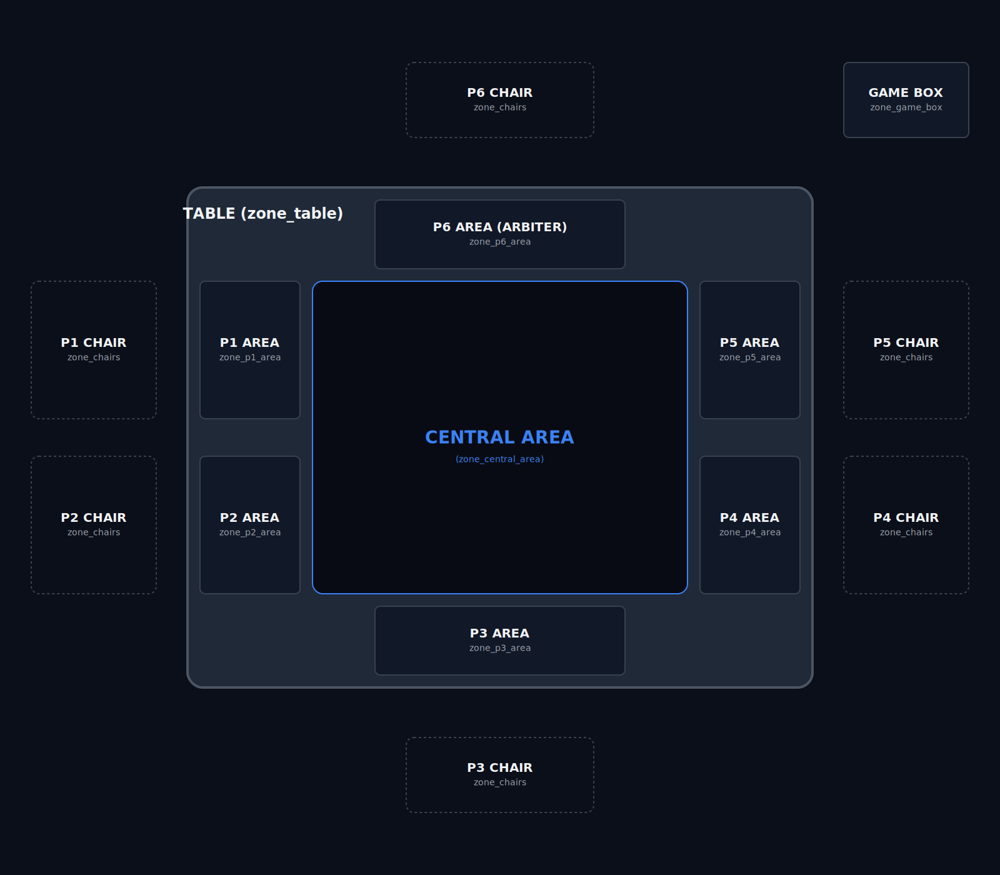
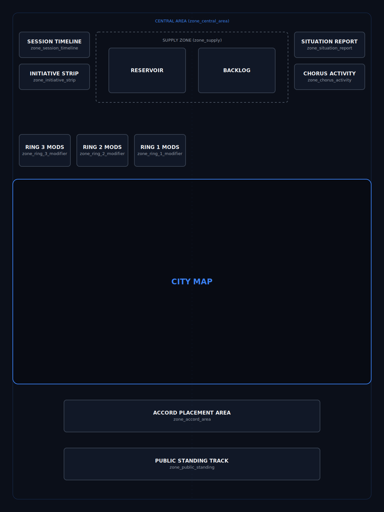

# 01 — Game Board: New Meridian
## THE SIGNAL P1 — Paper Prototype

**Version:** 2.3 — S90 (§4 Narrative Function and §6 Physical Forms migrated to Art 02; geography/zone-only). S114 (agy): DB-driven geography metadata blocks added, procedural content moved to Whiteboard. S130 (agy): §6.5 District Adjacency Map rewritten (Ring+Address schema); NM_Overlay.svg labels updated (ADD: R.P format); district_adjacency DB migrated — FK approach via game_zones (L238). Pending review and re-sign-off.  
**Status:** ✅ Signed Off — v2.3 S130  
**Depends on:** 00 — Factions, World & Narrative Context  
**Supersedes:** setup_guide (board sections), board_layout (visual reference only)

---

## 1. Overview

### Problem This Document Solves
The game board physically models the in-universe Council room (the ARBITER's seat, the Faction Terminals, and the central city projection). Without a meticulously defined layout bridging these spaces, no other artifact can accurately define where actions target, where resources generate, or how adjacency is calculated. The requirement is a single, unambiguous source of truth for all physical geometries and zone hierarchies on the table.

### Deliverable
A complete, normalized specification of the physical game environment. This includes structural layout wireframes (SVGs) and database-backed metadata (`the_signal_db`) mapping out every physical table zone (ARBITER area, faction areas, central play surface, and supply) and the entire concentric district map (Ring 0 to 3).

### Success Criteria
- Provides structural SVGs and normalized database schemas that serve as the unquestionable source of truth for physical component production.
- Any player can inspect the board layout and map boundaries to natively calculate adjacency relationships.
- The physical tabletop layout actively enforces the diegetic immersion of the fictional room, mapping table seats to Council seats.

*(Status: These criteria have been successfully realized within this artifact).*

---

## 2. Index

1. [Overview](#1-overview)
2. [Index](#2-index)
3. [Game Purpose](#3-game-purpose)
4. [Narrative Function](#4-narrative-function)
5. [Design Principles](#5-design-principles)
6. [Physical Environment — Zones and Districts](#6-physical-environment-zones-and-districts)
   - [§6.1 Universal Schemas](#61-universal-schemas)
   - [§6.2 Zone Hierarchy Reference](#62-zone-hierarchy-reference)
   - [§6.3 Detailed Zone Specifications](#63-detailed-zone-specifications)
   - [§6.4 Detailed District Specifications](#64-detailed-district-specifications)
   - [§6.5 District Adjacency Map](#65-district-adjacency-map)
7. [Faction Player Areas](#7-faction-player-areas)
8. [ARBITER Area](#8-arbiter-area)

---

## 3. Game Purpose

The board serves four simultaneous functions:

**Economic ledger:** All resource generation is readable from the district attributes. Presence levels, influence tiers, and structures together determine faction income each round, mapped to the static values defined in this geography.

**Territorial record:** The map coordinates and connections define the geography over which factions contest control.

**Information display:** The board provides the physical zones where shared tracks and decks are placed.

**Narrative stage:** The physical game table is a recreation of the actual setting where The Table convenes. Faction Representatives gather around the same surface that exists in the fiction: a private chamber at the Chorus Node, each seat corresponding to a player position, and the ARBITER Screen separating authority from process.

---

## 4. Narrative Function

The physical game space *is* the room where the Table sits. The tabletop layout physically models MIRROR — the human-built architectural interface that renders New Meridian as legible terrain.

When players sit down to play, they are assuming their exact positions in the evaluative configuration (as established in [00___Vision_and_Foundations.md](file:///home/abosch/Projects/TheSignal/V1/00___Vision_and_Foundations.md)): 
- **The Faction Player Area** is the Representative's actual secure terminal. There are exactly five positions.
- **The ARBITER Area** is the head of the room, physically occupied by the mediating instrument.
- **The Central Area** is MIRROR's projection of The Overview, rendering live status overlays and systemic metrics directly onto the surface of the Table.

The intent is immersion through geometry: it should feel exactly as if the players are physically standing in that sealed room with ARBITER, watching MIRROR map the city unfolding between them. The architecture of the game board enforces the architecture of the fiction.

---

## 5. Design Principles

1. **Immersion through Geometry.** The tabletop layout physically enforces the fiction. Players aren't just sitting at a table; they are sitting in their faction's specific seat in the Council room, looking at MIRROR.
2. **Database-Backed Truth.** Map geography is strictly structural. Every zone, district, and boundary is mapped in our database schema (`the_signal_db`). If it's on the board, it has specific gameplay consequences.
3. **The Center Drives Conflict.** The Chorus Node (Ring 0) at the center of the board remains the primary strategic objective. It pulls the factions inward to compete for access, driving the core tension of the session.
4. **Immediate Legibility.** The board needs to be instantly readable from across the table. Resource types, ring levels, and district control must be visually distinct at a glance so players can assess the board state without reading fine text.
5. **Clear Public vs. Private States.** Faction Terminals represent secure data and remain entirely private behind screens. The central board (The Overview) is the shared public space. Gameplay actions explicitly govern how information moves from private hands to the public board.

---

## 6. Physical Environment — Zones and Districts

*Macro Table Layout: Illustrates the grand-parent physical environment. The ARBITER (P6) is positioned at the head of the table; Faction Players (P1–P5) are arranged around the remaining perimeter; the Central Area anchors the center. The Game Box and Player Chairs sit outside the table perimeter.*

*Central Area Layout: Illustrates the detailed, canonical arrangement of shared tabletop zones within the Central Area. This includes the public tracks (Session Timeline, Initiative Strip, Situation Report, Chorus Activity, Public Standing), the Accord Placement Area, the Supply Zone (Reservoir and Backlog), the Ring Modifiers, and the City Map footprint.*

*District layout diagram: concentric Ring 0–3 geography mapping the 21 districts of New Meridian, overlaid with their spatial connections and boundaries. The district native resource types are color-keyed by the hex code for that resource (and native faction) and shown in the legend.*

### Board Shape and Orientation
New Meridian is structured as a collection of arcs forming an inverted half-circle shape. The Chorus Node is placed at the top center. Districts radiate outward and downward — Core districts immediately below the Node, The Mid below that, Baryo at the outer edges.

District shapes represent actual city districts. Borders between adjacent districts are clearly marked. Faction color must be readable on districts.

### Ring Structure
The board's concentric ring layout organizes the 21 districts into distinct layers:
- **Baryo (Ring 3):** 9 districts.
- **The Mid (Ring 2):** 7 districts.
- **Core (Ring 1):** 4 districts.
- **Chorus Node (Ring 0):** 1 district.

*(Note: Resource yields and entry requirements have been moved to the art03 gameplay rules staging area, as they are procedures rather than geometry).*

### District Static Display Requirements
Every district on the board must display the following static metadata:
1. **District name:** Printed text.
2. **Ring:** Visual border weight or position in arc.
3. **Resource type:** Background color.
4. **Base generation value:** Printed number.
5. **Special rules:** Print a distinct icon on specialized districts (Chorus Node, Residential Quarter). **[NEEDS VISUAL DESIGN]**

*Open Question: Should these display requirements (which are effectively print specs) remain in this structural artifact, or should they be moved? We could also design a sample "Example District SVG" component that models exactly how these elements are visually laid out.*

---

### 6.1 Universal Schemas

To maintain synchronization with `the_signal_db`, all physical areas (zones) and map regions (districts) are defined using standardized metadata schemas.

#### 6.1.1 Zone Schema
Feeds the `game_zones` database table.
* `db_id`: Integer (Primary Key)
* `zone_id`: String (Unique identifier, e.g. `zone_table`)
* `zone_name`: String (Display name)
* `parent_zone_id`: String (FK reference to parent `zone_id`, or `None` if root)
* `visibility`: Enum (`Public` | `Private` | `Mixed`)

#### 6.1.2 District Schema
Feeds the `district_metadata` database table.
* `db_id`: Integer (Primary Key, matches district number 1–21)
* `district_name`: String (Display name)
* `ring`: Enum (`Ring 0` | `Ring 1` | `Ring 2` | `Ring 3`)
* `resource_type`: Enum (`Mandate` | `Findings` | `Capital` | `Capacity` | `Exposure` | `None`)
* `base_generation_value`: Integer (Base resources produced per Quarter: 0 to 3)
* `hex_color`: String (Aesthetic CSS hex code, or `None` if N/A)

---

### 6.2 Zone Hierarchy Reference

| Zone | Parent | Description / Type |
|------|--------|---------------------|
| Game Box | None | Out of play component storage |
| Chairs | None | Seating positions outside Table perimeter |
| Table | None | Main playing surface |
| P1–P5 | Table | Faction player positions |
| P6 | Table | ARBITER area |
| Central Area | Table | Shared center play surface |
| Supply | Central Area | Shared supply zone |
| Accord Placement Area | Central Area | Shared active Accord documents zone |
| Session Timeline Area | Central Area | Timeline track zone |
| Initiative Strip Area | Central Area | Initiative Strip zone |
| Chorus Activity Track Area | Central Area | Chorus Activity Track zone |
| Situation Report Area | Central Area | Situation Report card zone |
| Public Standing Track Area | Central Area | Public Standing track zone |
| City | Central Area | Map region on the Overview |
| Ring 0 | City | Chorus Node ring |
| Ring 1 | City | Core ring |
| Ring 2 | City | The Mid ring |
| Ring 3 | City | Baryo ring |
| Ring 1 Modifier Area | Ring 1 | Modifier Deck zone for Ring 1 |
| Ring 2 Modifier Area | Ring 2 | Modifier Deck zone for Ring 2 |
| Ring 3 Modifier Area | Ring 3 | Modifier Deck zone for Ring 3 |

---

### 6.3 Detailed Zone Specifications

| Zone Name | DB ID | Zone ID | Parent Zone ID | Visibility | Description |
|-----------|-------|---------|----------------|------------|-------------|
| Game Box | 1 | `zone_game_box` | `None` | `Private` |  |
| Chairs | 2 | `zone_chairs` | `None` | `Public` | Represents seat positions Chair 1–6. Chair 6 is assigned to the ARBITER (P6); Chairs 1–5 correspond to Faction Players (P1–P5). |
| Table | 3 | `zone_table` | `None` | `Public` | The physical table surface. |
| Faction Player Areas | 4 | `zone_p1_area` to `zone_p5_area` | `zone_table` | `Mixed` | Private and public tablespace at each player position. The space behind each Faction Screen is private/concealed; the space in front of each screen is public. |
| ARBITER Area | 5 | `zone_p6_area` | `zone_table` | `Mixed` | The head of the table. The space behind the ARBITER Screen is private/concealed; the space in front is public. |
| Central Area | 6 | `zone_central_area` | `zone_table` | `Public` | Shared center play surface holding the game board mat (The Overview). |
| Supply | 7 | `zone_supply` | `zone_central_area` | `Public` |  |
| Accord Placement Area | 8 | `zone_accord_area` | `zone_central_area` | `Public` |  |
| Session Timeline Area | 9 | `zone_session_timeline` | `zone_central_area` | `Public` |  |
| Initiative Strip Area | 10 | `zone_initiative_strip` | `zone_central_area` | `Public` |  |
| Chorus Activity Track Area | 11 | `zone_chorus_activity` | `zone_central_area` | `Public` |  |
| Situation Report Area | 12 | `zone_situation_report` | `zone_central_area` | `Public` |  |
| Public Standing Track Area | 13 | `zone_public_standing` | `zone_central_area` | `Public` |  |
| City | 14 | `zone_city` | `zone_central_area` | `Public` | Represents the organic half-circle city map on the Overview. Concentric rings branch outwards from Ring 0 to Ring 3. |
|  | `db_id` |  |  |  |  |
|  | `db_id` |  |  |  |  |

### 6.4 Detailed District Specifications

All 21 districts of New Meridian function as child zones of their respective rings.

| District Name | DB ID | Ring | Resource Type | Base Gen | Hex Color | Description |
|---------------|-------|------|---------------|----------|-----------|-------------|
| Chorus Node | 600 | Ring 0 | None | 0 | None | The center of the city. Source of the Signal and focus of high-level faction translation operations. |
| Government Citadel | 602 | Ring 1 | Mandate | 3 | `#3a6ea8` |  |
| Military Installation | 601 | Ring 1 | Mandate | 3 | `#3a6ea8` |  |
| Chorus Research | 603 | Ring 1 | Findings | 3 | `#6a9978` |  |
| Financial Sanctum | 604 | Ring 1 | Capital | 3 | `#c9a84c` |  |
| Power Grid | 606 | Ring 2 | Capacity | 2 | `#d4622a` |  |
| Financial Clearinghouse | 611 | Ring 2 | Capital | 2 | `#c9a84c` |  |
| Data Exchange | 609 | Ring 2 | Findings | 2 | `#6a9978` |  |
| Communications Hub | 610 | Ring 2 | Exposure | 2 | `#39d353` |  |
| Logistics Center | 607 | Ring 2 | Capacity | 2 | `#d4622a` |  |
| Research Institute | 608 | Ring 2 | Findings | 2 | `#6a9978` |  |
| Regulatory District | 605 | Ring 2 | Mandate | 2 | `#3a6ea8` |  |
| Industrial Fringe | 612 | Ring 3 | Capacity | 1 | `#d4622a` |  |
| Transit Hub | 613 | Ring 3 | Capacity | 1 | `#d4622a` |  |
| Civic Center | 614 | Ring 3 | Mandate | 1 | `#3a6ea8` |  |
| Residential Quarter | 615 | Ring 3 | Mandate | 1 | `#3a6ea8` |  |
| University Perimeter | 616 | Ring 3 | Findings | 1 | `#6a9978` |  |
| Media District | 617 | Ring 3 | Exposure | 1 | `#39d353` |  |
| Broadcast Tower | 618 | Ring 3 | Exposure | 1 | `#39d353` |  |
| Observation Post | 619 | Ring 3 | Exposure | 1 | `#39d353` |  |
| Commercial Strip | 620 | Ring 3 | Capital | 1 | `#c9a84c` |  |

### 6.5 District Adjacency Map

Canonical adjacency reference for all 21 districts. Feeds the `district_adjacency` table in `the_signal_db`.

| Ring | Address | Origin District | Adjacent Ring | Adjacent Address | Adjacent District | Allow Ingress | Allow Egress |
|------|---------|----------------|--------------|-----------------|-------------------|--------------|-------------|
| Ring 0 | 0.0 | Chorus Node | Ring 1 | 1.0 | Military Installation | TRUE | TRUE |
| Ring 0 | 0.0 | Chorus Node | Ring 1 | 1.1 | Government Citadel | TRUE | TRUE |
| Ring 0 | 0.0 | Chorus Node | Ring 1 | 1.2 | Chorus Research | TRUE | TRUE |
| Ring 0 | 0.0 | Chorus Node | Ring 1 | 1.3 | Financial Sanctum | TRUE | TRUE |
| Ring 1 | 1.0 | Military Installation | Ring 0 | 0.0 | Chorus Node | TRUE | TRUE |
| Ring 1 | 1.0 | Military Installation | Ring 1 | 1.1 | Government Citadel | TRUE | TRUE |
| Ring 1 | 1.0 | Military Installation | Ring 2 | 2.0 | Regulatory District | TRUE | TRUE |
| Ring 1 | 1.0 | Military Installation | Ring 2 | 2.1 | Power Grid | TRUE | TRUE |
| Ring 1 | 1.1 | Government Citadel | Ring 0 | 0.0 | Chorus Node | TRUE | TRUE |
| Ring 1 | 1.1 | Government Citadel | Ring 1 | 1.0 | Military Installation | TRUE | TRUE |
| Ring 1 | 1.1 | Government Citadel | Ring 1 | 1.2 | Chorus Research | TRUE | TRUE |
| Ring 1 | 1.1 | Government Citadel | Ring 2 | 2.1 | Power Grid | TRUE | TRUE |
| Ring 1 | 1.1 | Government Citadel | Ring 2 | 2.2 | Logistics Center | TRUE | TRUE |
| Ring 1 | 1.1 | Government Citadel | Ring 2 | 2.3 | Research Institute | TRUE | TRUE |
| Ring 1 | 1.2 | Chorus Research | Ring 0 | 0.0 | Chorus Node | TRUE | TRUE |
| Ring 1 | 1.2 | Chorus Research | Ring 1 | 1.1 | Government Citadel | TRUE | TRUE |
| Ring 1 | 1.2 | Chorus Research | Ring 1 | 1.3 | Financial Sanctum | TRUE | TRUE |
| Ring 1 | 1.2 | Chorus Research | Ring 2 | 2.3 | Research Institute | TRUE | TRUE |
| Ring 1 | 1.2 | Chorus Research | Ring 2 | 2.4 | Data Exchange | TRUE | TRUE |
| Ring 1 | 1.2 | Chorus Research | Ring 2 | 2.5 | Communications Hub | TRUE | TRUE |
| Ring 1 | 1.3 | Financial Sanctum | Ring 0 | 0.0 | Chorus Node | TRUE | TRUE |
| Ring 1 | 1.3 | Financial Sanctum | Ring 1 | 1.2 | Chorus Research | TRUE | TRUE |
| Ring 1 | 1.3 | Financial Sanctum | Ring 2 | 2.5 | Communications Hub | TRUE | TRUE |
| Ring 1 | 1.3 | Financial Sanctum | Ring 2 | 2.6 | Financial Clearinghouse | TRUE | TRUE |
| Ring 2 | 2.0 | Regulatory District | Ring 1 | 1.0 | Military Installation | TRUE | TRUE |
| Ring 2 | 2.0 | Regulatory District | Ring 2 | 2.1 | Power Grid | TRUE | TRUE |
| Ring 2 | 2.0 | Regulatory District | Ring 3 | 3.0 | Industrial Fringe | TRUE | TRUE |
| Ring 2 | 2.0 | Regulatory District | Ring 3 | 3.1 | Transit Hub | TRUE | TRUE |
| Ring 2 | 2.1 | Power Grid | Ring 1 | 1.0 | Military Installation | TRUE | TRUE |
| Ring 2 | 2.1 | Power Grid | Ring 1 | 1.1 | Government Citadel | TRUE | TRUE |
| Ring 2 | 2.1 | Power Grid | Ring 2 | 2.0 | Regulatory District | TRUE | TRUE |
| Ring 2 | 2.1 | Power Grid | Ring 2 | 2.2 | Logistics Center | TRUE | TRUE |
| Ring 2 | 2.1 | Power Grid | Ring 3 | 3.1 | Transit Hub | TRUE | TRUE |
| Ring 2 | 2.1 | Power Grid | Ring 3 | 3.2 | Civic Center | TRUE | TRUE |
| Ring 2 | 2.2 | Logistics Center | Ring 1 | 1.1 | Government Citadel | TRUE | TRUE |
| Ring 2 | 2.2 | Logistics Center | Ring 2 | 2.1 | Power Grid | TRUE | TRUE |
| Ring 2 | 2.2 | Logistics Center | Ring 2 | 2.3 | Research Institute | TRUE | TRUE |
| Ring 2 | 2.2 | Logistics Center | Ring 3 | 3.2 | Civic Center | TRUE | TRUE |
| Ring 2 | 2.2 | Logistics Center | Ring 3 | 3.3 | Residential Quarter | TRUE | TRUE |
| Ring 2 | 2.3 | Research Institute | Ring 1 | 1.1 | Government Citadel | TRUE | TRUE |
| Ring 2 | 2.3 | Research Institute | Ring 1 | 1.2 | Chorus Research | TRUE | TRUE |
| Ring 2 | 2.3 | Research Institute | Ring 2 | 2.2 | Logistics Center | TRUE | TRUE |
| Ring 2 | 2.3 | Research Institute | Ring 2 | 2.4 | Data Exchange | TRUE | TRUE |
| Ring 2 | 2.3 | Research Institute | Ring 3 | 3.3 | Residential Quarter | TRUE | TRUE |
| Ring 2 | 2.3 | Research Institute | Ring 3 | 3.4 | University Perimeter | TRUE | TRUE |
| Ring 2 | 2.3 | Research Institute | Ring 3 | 3.5 | Media District | TRUE | TRUE |
| Ring 2 | 2.4 | Data Exchange | Ring 1 | 1.2 | Chorus Research | TRUE | TRUE |
| Ring 2 | 2.4 | Data Exchange | Ring 2 | 2.3 | Research Institute | TRUE | TRUE |
| Ring 2 | 2.4 | Data Exchange | Ring 2 | 2.5 | Communications Hub | TRUE | TRUE |
| Ring 2 | 2.4 | Data Exchange | Ring 3 | 3.5 | Media District | TRUE | TRUE |
| Ring 2 | 2.4 | Data Exchange | Ring 3 | 3.6 | Broadcast Tower | TRUE | TRUE |
| Ring 2 | 2.5 | Communications Hub | Ring 1 | 1.2 | Chorus Research | TRUE | TRUE |
| Ring 2 | 2.5 | Communications Hub | Ring 1 | 1.3 | Financial Sanctum | TRUE | TRUE |
| Ring 2 | 2.5 | Communications Hub | Ring 2 | 2.4 | Data Exchange | TRUE | TRUE |
| Ring 2 | 2.5 | Communications Hub | Ring 2 | 2.6 | Financial Clearinghouse | TRUE | TRUE |
| Ring 2 | 2.5 | Communications Hub | Ring 3 | 3.6 | Broadcast Tower | TRUE | TRUE |
| Ring 2 | 2.5 | Communications Hub | Ring 3 | 3.7 | Observation Post | TRUE | TRUE |
| Ring 2 | 2.6 | Financial Clearinghouse | Ring 1 | 1.3 | Financial Sanctum | TRUE | TRUE |
| Ring 2 | 2.6 | Financial Clearinghouse | Ring 2 | 2.5 | Communications Hub | TRUE | TRUE |
| Ring 2 | 2.6 | Financial Clearinghouse | Ring 3 | 3.7 | Observation Post | TRUE | TRUE |
| Ring 2 | 2.6 | Financial Clearinghouse | Ring 3 | 3.8 | Commercial Strip | TRUE | TRUE |
| Ring 3 | 3.0 | Industrial Fringe | Ring 2 | 2.0 | Regulatory District | TRUE | TRUE |
| Ring 3 | 3.0 | Industrial Fringe | Ring 3 | 3.1 | Transit Hub | TRUE | TRUE |
| Ring 3 | 3.1 | Transit Hub | Ring 2 | 2.0 | Regulatory District | TRUE | TRUE |
| Ring 3 | 3.1 | Transit Hub | Ring 2 | 2.1 | Power Grid | TRUE | TRUE |
| Ring 3 | 3.1 | Transit Hub | Ring 3 | 3.0 | Industrial Fringe | TRUE | TRUE |
| Ring 3 | 3.1 | Transit Hub | Ring 3 | 3.2 | Civic Center | TRUE | TRUE |
| Ring 3 | 3.2 | Civic Center | Ring 2 | 2.1 | Power Grid | TRUE | TRUE |
| Ring 3 | 3.2 | Civic Center | Ring 2 | 2.2 | Logistics Center | TRUE | TRUE |
| Ring 3 | 3.2 | Civic Center | Ring 3 | 3.1 | Transit Hub | TRUE | TRUE |
| Ring 3 | 3.2 | Civic Center | Ring 3 | 3.3 | Residential Quarter | TRUE | TRUE |
| Ring 3 | 3.3 | Residential Quarter | Ring 2 | 2.2 | Logistics Center | TRUE | TRUE |
| Ring 3 | 3.3 | Residential Quarter | Ring 2 | 2.3 | Research Institute | TRUE | TRUE |
| Ring 3 | 3.3 | Residential Quarter | Ring 3 | 3.2 | Civic Center | TRUE | TRUE |
| Ring 3 | 3.3 | Residential Quarter | Ring 3 | 3.4 | University Perimeter | TRUE | TRUE |
| Ring 3 | 3.4 | University Perimeter | Ring 2 | 2.3 | Research Institute | TRUE | TRUE |
| Ring 3 | 3.4 | University Perimeter | Ring 3 | 3.3 | Residential Quarter | TRUE | TRUE |
| Ring 3 | 3.4 | University Perimeter | Ring 3 | 3.5 | Media District | TRUE | TRUE |
| Ring 3 | 3.5 | Media District | Ring 2 | 2.3 | Research Institute | TRUE | TRUE |
| Ring 3 | 3.5 | Media District | Ring 2 | 2.4 | Data Exchange | TRUE | TRUE |
| Ring 3 | 3.5 | Media District | Ring 3 | 3.4 | University Perimeter | TRUE | TRUE |
| Ring 3 | 3.5 | Media District | Ring 3 | 3.6 | Broadcast Tower | TRUE | TRUE |
| Ring 3 | 3.6 | Broadcast Tower | Ring 2 | 2.4 | Data Exchange | TRUE | TRUE |
| Ring 3 | 3.6 | Broadcast Tower | Ring 2 | 2.5 | Communications Hub | TRUE | TRUE |
| Ring 3 | 3.6 | Broadcast Tower | Ring 3 | 3.5 | Media District | TRUE | TRUE |
| Ring 3 | 3.6 | Broadcast Tower | Ring 3 | 3.7 | Observation Post | TRUE | TRUE |
| Ring 3 | 3.7 | Observation Post | Ring 2 | 2.5 | Communications Hub | TRUE | TRUE |
| Ring 3 | 3.7 | Observation Post | Ring 2 | 2.6 | Financial Clearinghouse | TRUE | TRUE |
| Ring 3 | 3.7 | Observation Post | Ring 3 | 3.6 | Broadcast Tower | TRUE | TRUE |
| Ring 3 | 3.7 | Observation Post | Ring 3 | 3.8 | Commercial Strip | TRUE | TRUE |
| Ring 3 | 3.8 | Commercial Strip | Ring 2 | 2.6 | Financial Clearinghouse | TRUE | TRUE |
| Ring 3 | 3.8 | Commercial Strip | Ring 3 | 3.7 | Observation Post | TRUE | TRUE |

---

## 7. Faction Player Areas

The Faction Player Areas (P1–P5) are divided into public and private zones, physically separated by a Faction Screen. 

We are planning to build a dedicated zoomed-in SVG map (`Faction_Area_Layout.svg`) to explicitly define the physical geometries of these areas. This SVG will map directly to the `zone_p1_area` through `zone_p5_area` parent zones.

### Planned Layout Structure:
**Private Zone (Behind Screen - Concealed):**
- **Faction Terminal:** The core interface for managing concealed data, hidden agendas, and covert operations.
- **Hand Area:** Dedicated space for holding unplayed action/asset cards.
- **Private Resource Pool:** Storage for concealed tokens, capital, and findings.

**Public Zone (In Front of Screen - Visible):**
- **Active Operations Row:** A staging area for cards and actions currently in play or tabled for resolution.
- **Public Resource Pool:** Storage for publicly visible assets and mandate tokens.
- **Faction Identity Card:** Indicating the faction's current public standing, role, and persistent passive abilities.

---

## 8. ARBITER Area

The ARBITER Area (P6) is located at the head of the table and is divided into public and private zones by the ARBITER Screen.

We are planning to build a dedicated zoomed-in SVG map (`Arbiter_Area_Layout.svg`) to map the physical geometries of the Arbiter's domain, linking directly to the `zone_p6_area`.

### Planned Layout Structure:
**Private Zone (Behind Screen - Concealed):**
- **Arbiter Terminal:** The primary interface for managing system events, global thresholds, narrative pacing, and scenario scripts.
- **Event Decks & Discards:** Staging areas for incoming city events and resolved narratives.
- **Hidden Modifiers:** Space for concealed scenario overrides and upcoming triggers.

**Public Zone (In Front of Screen - Visible):**
- **Global Status Trackers:** Tokens and markers indicating current city-wide alert levels or systemic states.
- **Active Edicts & Directives:** Publicly revealed conditions currently impacting all Faction players.

