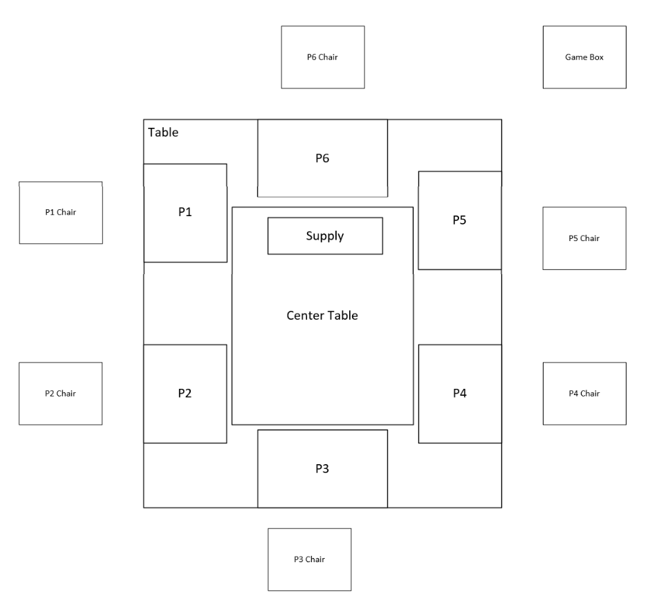
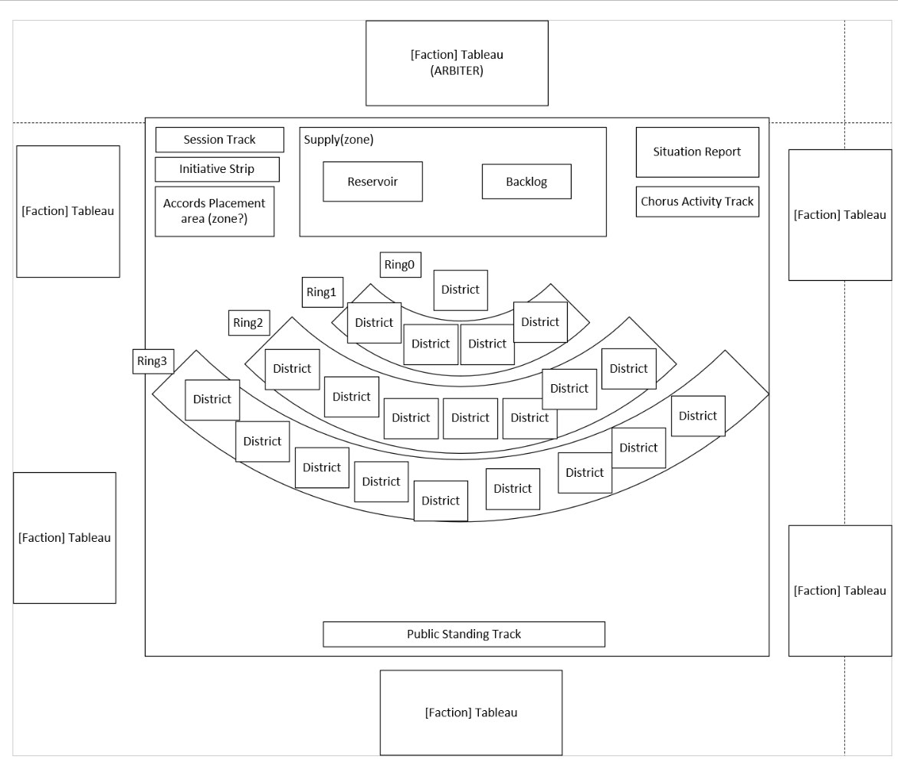

# 01 — Game Board: New Meridian
## THE SIGNAL P1 — Paper Prototype

**Version:** 2.0 — Signed Off — S74 (§6 Component Physical Forms added S73; "Proposed Form" column header S74. Open: 01-10 table migration → Art 02a; 01-11 scope overhaul)  
**Status:** Signed Off  
**Depends on:** 00 — Factions, World & Narrative Context  
**Supersedes:** setup_guide (board sections), board_layout (visual reference only)

---

## 1. Overview

### Problem This Document Solves
The game operates across two distinct physical spaces: the shared table where all public information is displayed, and each faction's private zone where Terminal contents remain concealed. Without a fully specified layout for both, no other artifact can define where actions target, where resources generate, where presence is tracked, or what information is visible to whom. This document defines the complete physical environment — every table zone, every component placement, every district, every track — in sufficient detail that visual design and physical production can proceed without ambiguity.

### Deliverable
A complete specification of the physical game environment: the table zone structure (ARBITER area, faction areas, central play surface, and supply), The Overview mat with its district map, Ring Modifier decks, information tracks, and Situation Report zone; MIRROR and faction Terminal placement and access rules; and the starting configuration that opens every session.

### Success Criteria
- Any player can look at The Overview mid-session and calculate every faction's current resource income without assistance
- ARBITER can manage all board-state changes from their position without needing to touch faction areas
- The board's visual organization reflects the narrative geography of New Meridian — the Chorus Node at the top, the city spreading outward and downward
- A visual designer can produce a complete layout wireframe from this document alone without ambiguity

---

## 2. Index

1. [Overview](#1-overview)
2. [Index](#2-index)
3. [Game Purpose](#3-game-purpose)
4. [Narrative Function](#4-narrative-function)
5. [Design Principles](#5-design-principles)
6. [Physical Environment — Zones and Components](#6-physical-environment-zones-and-components)
7. [Rules & Constraints](#7-rules-constraints)
8. [Starting Configuration](#8-starting-configuration)
9. [Faction Player Tableau](#9-faction-player-tableau)
10. [ARBITER Tableau](#10-arbiter-tableau)
11. [Special Conditions & Gameplay Impacts](#11-special-conditions-gameplay-impacts)
12. [Examples & Exceptions](#12-examples-exceptions)

---

## 3. Game Purpose

The board serves four simultaneous functions:

**Economic ledger:** All resource generation is readable from The Overview. Presence tokens, influence levels, and structure tokens together determine every faction's income each round. No hidden calculations required.

**Territorial record:** The current state of contested and controlled districts is always visible. Any player can assess the balance of power at a glance.

**Information display:** All shared tracks — World Conditions, the Session Timeline, initiative order, active Situation Report cards, Public Standing, active Accords — are displayed on or adjacent to The Overview and updated in real time.

**Narrative stage:** The physical game table is not an abstraction of New Meridian — it is a recreation of the actual setting where The Table convenes. Faction Representatives gather around the same surface, in the same configuration, that exists in the fiction: a private chamber at the Chorus Node, MIRROR projecting The Overview at the center of the table, each Representative's Terminal at their seat, the ARBITER screen separating authority from process. When players take their positions, they are not playing characters who attend The Table — they are inhabiting those seats. The district map, the track placements, the screen positions — all of it corresponds to a real place in the fiction. The session begins where the story already is.

---

## 4. Narrative Function

The physical components of New Meridian are not abstract pieces — each represents a specific system, instrument, or document that ARBITER monitors and the factions contend for. This section grounds each component in the fiction.

*Components with narrative in other artifacts: Reservoir, Backlog, Dispatch Tokens → Art 02a §4. Public Standing Track, Chorus Portrait Track → Art 02b §4.*

### District Tiles — The Civic Grid

The layout of New Meridian projected by MIRROR is not a natural map — it is a political compromise turned infrastructure. Dr. Jae-won Seo, Chief Data Architect, designed the original grid as a fluid topographic model: heat-mapped to population density, economic flow, and resource access. The Directorate Security Liaison vetoed it, demanding rigid, fixed zones defined by blast doors, riot barricades, and power-grid kill switches. The Security Liaison won. The resulting Civic Grid is brutalist and functional — it shows not what the city is, but how it can be partitioned, locked down, and violently controlled in an emergency. MIRROR projects it because it is accurate. Not to geography. To power.

### Influence Level Marker — Dominance

Presence on the board measures physical occupation. Dominance measures something different: administrative control. When a faction reaches Dominance in a district, MIRROR formally registers the shift — the faction now controls the traffic routing, municipal drone corridors, and utility outputs of that zone. ARBITER tracks Dominance continuously because raw presence without administrative override is temporary. Dominance is not. It is the signal that a faction has stopped occupying a district and started operating it.

### Tension Markers — The Contested State

New Meridian runs a city-wide surveillance mesh — biometric sensors, acoustic arrays, thermal monitoring — originally installed for predictive medical response. MIRROR repurposed it. When the system detects localized threshold breaches — acoustic signatures of violence, crowd biometric spikes, encrypted radio bursts — it flags the district on The Overview. The Tension Marker is MIRROR's notation that a district's equilibrium has broken. ARBITER does not interpret it. It records it.

### Session Timeline — The Count

ARBITER is not counting down. It is counting up toward a specific threshold — the point at which humanity's aggregate response to the Chorus reaches what ARBITER designates as Integration. Quarter 8 marks the moment the return channel opens, whatever position the factions hold. The factions do not know what Integration produces. They know the count. They know it does not stop.

### Initiative Strip — Operational Readiness

The Initiative Strip is ARBITER's real-time ranking of each faction's operational capacity — drawn from continuous inputs: supply chain throughput, operative response times, resource allocation speed, leadership decision latency. ARBITER does not share its methodology. A faction may believe it is executing at full capacity and find itself ranked last. The ranking is not punitive. It is observational. ARBITER records the order in which the city is being moved.

### Chorus Activity Track — The Seismograph

ARBITER added this display to MIRROR's interface without being asked. No label. No unit of measurement. No explanation. The factions named it the Seismograph — a frightened metaphor for a graphic no one understands. The Directorate insists it measures signal degradation. Ghost is certain it tracks the transmission's recursive proximity to full comprehension. The Guild argues it reflects the physical stress the signal places on New Meridian's infrastructure. Every faction has a theory; every faction presents their theory as confirmed. The only consensus is that the track reacts to what happens at the table — when operations execute, resources concentrate, or tensions escalate, the display moves. ARBITER provides no reason for the correlation. It projects the data and waits.

### Accord Documents — Biometric Registry

Accord Documents are biometric smart-paper. When placed face-up on the scanner beds of The Overview, MIRROR reads the signatures of the parties and registers the agreement into ARBITER's canonical record. The act of placement is binding. ARBITER does not negotiate terms. It records what was signed.

### Situation Reports — Global Signal

Situation Reports are not local events. They are global shockwaves — market collapses, atmospheric anomalies, intercepted diplomatic transmissions, mass migrations. They reach the table because New Meridian is not isolated; it is the point through which everything else is being filtered. The Reports remind the room that the rest of the world continues to generate signal while the factions contest the city.

---

## 5. Design Principles

1. **The Overview is truth.** All presence tokens, operational markers, structure tokens, and influence level markers on The Overview are visible to all players at all times. No board state on the shared surface is ever hidden.

2. **Geography creates consequences.** A district's ring determines its resource generation value. A district's neighbors contribute to Battlefield Strength calculations and determine operational marker placement eligibility. Position on the map is never arbitrary.

3. **The center is always relevant.** The Chorus Node's strategic incentives — Chorus Activity suppression, Chorus Portrait amplifier, Chorus Question access, Translation rate scaling — ensure it remains a contested objective throughout the session regardless of its lack of resource output.

4. **Rings are not equal.** Sprawl districts are accessible and low-value. Infrastructure districts are the economic engine of the mid-game. Core districts are high-value and require commitment to enter. This creates natural strategic progression across a session.

5. **Resource type is immediately readable.** Each resource type has a distinct background color applied to the district. A player can identify the resource type of any district across the table without reading text.

6. **The Overview must be readable at speed.** During Resolution, ARBITER makes board changes quickly. Component shapes, colors, and placement conventions must allow ARBITER to update the board state without pausing to interpret what they are looking at.

7. **The Terminal is private.** What a Faction Representative holds, plans, and knows is concealed behind their faction screen. The Overview does not display Terminal contents. The tension between public commitment and private capability is a designed feature of the game.

---

## 6. Physical Environment — Zones and Components

*Zone diagram: P6 (ARBITER) at head of table; P1–P5 (Faction Players) arranged around remaining sides; Central Area at center with Supply zone; Game Box adjacent off-table; Chair 1–6 outside Table perimeter.*

*Component layout: The Overview (game mat) placed in Central Area; district tiles arranged in Ring 0–3 arcs; Supply zone (Reservoir, Backlog) near P6; Session Timeline and Initiative Strip left side; Chorus Activity Track and Situation Report Area right side; Public Standing Track bottom; Faction Tableaux in P1–P6 positions.*

**Zone vs. Component — Core Distinction**

A **zone** is a named location in physical space. Zones are infrastructure: the table surface, the seat positions, the areas of the mat. A zone exists whether or not anything occupies it. Zones form a self-referential hierarchy tracked in game_zones (zone_id, zone_name, parent_zone_id).

A **component** is a portable physical object. Everything in the game box is a component: the game mat, district tiles, tokens, cards, screens. Components are placed within zones during setup and play, and returned to the box at session end. Component location is tracked in live_state (zone_id → the zone it occupies; on_component_id → the component it rests on, if any).

A component and a zone may share the same physical footprint without being the same thing. The game mat (The Overview) fills Central Area during play — but Central Area is a zone that exists when the mat is packed away, and The Overview is a component that can be picked up and placed elsewhere. They are separate entities in the data model.

**Zone hierarchy — complete reference**

| Zone | Parent | Notes |
|------|--------|-------|
| Game Box | — | No children |
| Chair 1–6 | — | No children |
| Table | — | |
| P1–P5 | Table | Faction player positions |
| P6 | Table | ARBITER |
| Central Area | Table | |
| Supply | Central Area | |
| Accord Placement Area | Central Area | |
| Session Timeline Area | Central Area | |
| Initiative Strip Area | Central Area | |
| Chorus Activity Track Area | Central Area | |
| Situation Report Area | Central Area | |
| Public Standing Track Area | Central Area | |
| City | Central Area | District map region on The Overview |
| Ring 0 | City | Chorus Node ring |
| Ring 1 | City | Core ring |
| Ring 2 | City | The Mid ring |
| Ring 3 | City | Baryo ring |
| Ring 1 Modifier Area | Ring 1 | Left of Ring 1 arc |
| Ring 2 Modifier Area | Ring 2 | Left of Ring 2 arc |
| Ring 3 Modifier Area | Ring 3 | Left of Ring 3 arc |
| Chorus Node | Ring 0 | District zone |
| Government Citadel | Ring 1 | District zone |
| Military Installation | Ring 1 | District zone |
| Chorus Research | Ring 1 | District zone |
| Financial Sanctum | Ring 1 | District zone |
| Power Grid | Ring 2 | District zone |
| Financial Clearinghouse | Ring 2 | District zone |
| Data Exchange | Ring 2 | District zone |
| Communications Hub | Ring 2 | District zone |
| Logistics Center | Ring 2 | District zone |
| Research Institute | Ring 2 | District zone |
| Regulatory District | Ring 2 | District zone |
| Industrial Fringe | Ring 3 | District zone |
| Transit Hub | Ring 3 | District zone |
| Civic Center | Ring 3 | District zone |
| Residential Quarter | Ring 3 | District zone |
| University Perimeter | Ring 3 | District zone |
| Media District | Ring 3 | District zone |
| Broadcast Tower | Ring 3 | District zone |
| Observation Post | Ring 3 | District zone |
| Commercial Strip | Ring 3 | District zone |

### Game Box
Out of game. Components not yet in play. Kept adjacent to the table; serves as the source for all supply during setup and the return point for removed components. No child zones.

### Chair 1–6
Six individual seat positions. Each is a discrete zone with no child zones. Chair positions correspond to player positions: Chair 6 = ARBITER (P6); Chair 1–5 = Faction Players (P1–P5).

The human player is a named game entity tracked as a component in the data model — not a physical piece, but a seated participant whose location is their assigned chair (L155). Their zone_id at setup is their Chair zone. This is the only entity whose zone_id is a Chair zone rather than a Table zone.

### Table
The shared playing surface. All active play occurs here. Direct children: Central Area, P1–P6. P6 = ARBITER (head of table); P1–P5 = Faction Players.

#### P1–P5 — Faction Player Areas
One area per faction player, arranged around the sides of the table. Components at each position: Faction Screen (upright divider — creates a concealed area behind it); Faction Terminal (player tableau, sits on the table behind the screen); cards in hand and held resources behind the screen. Deployed components and active resources in front of the screen are visible to all players.

#### P6 — ARBITER
The head of the table. Components at this position: ARBITER Screen (upright divider — creates a concealed area on the table surface behind it, not visible to faction players); ARBITER Tableau (face-up reference surface in front of the screen, visible to all).

#### Central Area
Child zone of Table. The shared play surface at the center of the table. The game mat (The Overview) is a component placed here during setup — it occupies the same footprint as Central Area, but is portable and returned to the Game Box at session end. The zone exists independent of the component. Child zones: Supply, Accord Placement Area, Session Timeline Area, Initiative Strip Area, Chorus Activity Track Area, Situation Report Area, Public Standing Track Area, City.

##### Supply
Child zone of Central Area. The designated area for shared in-play component pools — The Reservoir, The Backlog, and other shared supply. Positioned near the P6 (ARBITER) end of Central Area. No child zones.

Components placed here:
| Component | Visibility | Narrative Reference |
|-----------|-----------|-------------------|
| Reservoir | Public | Art 02a §4 |
| Backlog | Public | Art 02a §4 |

##### Accord Placement Area
Child zone of Central Area. The designated area where all active Accord documents are placed face-up during play. Left side of Central Area (P1/P2 side). No child zones.

Components placed here:
| Component | Visibility | Narrative Reference |
|-----------|-----------|-------------------|
| Accord document (active) | Public | Art 01 §4 |

##### Session Timeline Area
Child zone of Central Area. The named position for the Session Timeline component. Left side of Central Area (P1/P2 side). No child zones.

Components placed here:
| Component | Visibility | Narrative Reference |
|-----------|-----------|-------------------|
| Session Timeline track | Public | Art 01 §4 |
| Pointer marker | Public | Included with Session Timeline track |

##### Initiative Strip Area
Child zone of Central Area. The named position for the Initiative Strip component. Left side of Central Area (P1/P2 side). No child zones.

Components placed here:
| Component | Visibility | Narrative Reference |
|-----------|-----------|-------------------|
| Initiative strip | Public | Art 01 §4 |
| Faction order markers (×5) | Public | Included with Initiative strip |

##### Chorus Activity Track Area
Child zone of Central Area. The named position for the Chorus Activity Track component. Right side of Central Area (P5 side). No child zones.

Components placed here:
| Component | Visibility | Narrative Reference |
|-----------|-----------|-------------------|
| Chorus Activity track | Public | Art 01 §4 |
| Activity marker | Public | Included with Chorus Activity track |
| Threshold marker | Public | Included with Chorus Activity track |

##### Situation Report Area
Child zone of Central Area. The named position where active World Event cards accumulate. Right side of Central Area (P5 side). No child zones.

Components placed here:
| Component | Visibility | Narrative Reference |
|-----------|-----------|-------------------|
| World Event card (active) | Public | Art 01 §4 |

##### Public Standing Track Area
Child zone of Central Area. The named position for the Public Standing Track component. Bottom of Central Area (P3 side). No child zones.

Components placed here:
| Component | Visibility | Narrative Reference |
|-----------|-----------|-------------------|
| Public Standing track (×5, one per faction) | Public | Art 02b §4 |
| Standing marker (×5, one per faction) | Public | Included with Public Standing track |

Band labels and standing tier definitions: Art 02b.

##### City
Child zone of Central Area. The region of The Overview's surface dedicated to the New Meridian city map. 21 district zones arranged in four concentric rings around the Chorus Node. The rings are sediment layers — each one a wave of growth as the city expanded outward from the transmission source.

District zones are named locations in physical space. District tiles are the components that occupy them. A district tile is placed within its corresponding district zone at setup; the zone defines where it goes, the tile is the portable object that holds that position.

The following components may be present within any district zone:
| Component | Visibility | Narrative Reference |
|-----------|-----------|-------------------|
| District tile | Public | Art 01 §4 |
| Presence chip | Public | Art 00 §14 |
| Deployment marker | Public | Art 00 §14 |
| Structure block | Public | Art 00 §14 |
| Influence level marker (Dominant) | Public | Art 01 §4 |
| Tension marker | Public | Art 01 §4 |

Each district tile prints its name, resource type (background color), and base generation value. All printed information remains visible regardless of components placed on it. District placement within each ring follows geographic and narrative logic — districts that depend on one another are adjacent; districts with historical faction relationships are near each other. The map is readable as a city, because it is one. Child zones: Ring 0, Ring 1, Ring 2, Ring 3.

###### Ring 0 — Chorus Node
Child zone of City. The single zone at the origin point of the city map. No Ring Modifier Deck — modifier decks apply to Rings 1–3 only. Child zone: Chorus Node.

| # | District Zone | Resource | Color | Narrative Placement |
|---|--------------|----------|-------|---------------------|
| 21 | Chorus Node | None | — | The origin point of everything. Placed at the top center of the map. All other districts grow from here. |

###### Ring 1 — Core
Child zone of City. The innermost ring of districts, immediately surrounding the Chorus Node. Base generation: 3 per Quarter. Child zones: Ring 1 Modifier Area, Government Citadel, Military Installation, Chorus Research, Financial Sanctum.

**Ring 1 Modifier Area** — child zone of Ring 1. Named position for the Ring 1 Modifier Deck component. Positioned to the left of the Ring 1 arc label (as oriented in component_layout_v1.png).

| # | District Zone | Resource | Color | Narrative Placement |
|---|--------------|----------|-------|---------------------|
| 17 | Government Citadel | Mandate | #3a6ea8 | West of center below the Node. The first permanent institution established after the readings were classified. Directorate presence here predates the city. |
| 18 | Military Installation | Mandate | #3a6ea8 | Far west of Core, adjacent to Government Citadel. Built to secure the Node perimeter. Positioned at the edge of the Core ring facing outward — a barrier between the city and the source. |
| 19 | Chorus Research | Findings | #6a9978 | East of center below the Node, adjacent to the Node itself. The primary scientific facility. Built as close to the Node as physically possible. |
| 20 | Financial Sanctum | Capital | #c9a84c | Far east of Core. Arrived after the research institutions — capital follows significance. Positioned at the edge of the Core ring facing outward toward the financial infrastructure below. |

###### Ring 2 — The Mid
Child zone of City. The working layer of the city, surrounding the Core. Base generation: 2 per Quarter. Child zones: Ring 2 Modifier Area, Power Grid, Financial Clearinghouse, Data Exchange, Communications Hub, Logistics Center, Research Institute, Regulatory District.

**Ring 2 Modifier Area** — child zone of Ring 2. Named position for the Ring 2 Modifier Deck component. Positioned to the left of the Ring 2 arc label.

| # | District Zone | Resource | Color | Narrative Placement |
|---|--------------|----------|-------|---------------------|
| 10 | Power Grid | Capacity | #d4622a | West side, adjacent to Military Installation. The Guild built the power systems that run the entire Node complex. Positioned close to the Directorate's military presence — the working relationship between them is geographic. |
| 11 | Financial Clearinghouse | Capital | #c9a84c | East side, below Financial Sanctum. The Syndicate's primary operational anchor. Positioned on the east side to mirror the Financial Sanctum above it — capital accumulates along the eastern corridor. |
| 12 | Data Exchange | Findings | #6a9978 | Center, below Chorus Research. The data infrastructure that processes everything coming from the Node. Ghost's analytical networks run through here. |
| 13 | Communications Hub | Exposure | #39d353 | Center-east, adjacent to Data Exchange. The broadcast and relay infrastructure. The Network's established foothold in The Mid — information generated in the Data Exchange flows east through here. |
| 14 | Logistics Center | Capacity | #d4622a | West-center, adjacent to Power Grid. Supply chain and distribution infrastructure supporting the Guild's operations. Positioned between the Power Grid and the Baryo's Industrial Fringe. |
| 15 | Research Institute | Findings | #6a9978 | Center-west, adjacent to Data Exchange and Chorus Research. Secondary research facility — overflow from the Core's research capacity, populated as the Chorus study expanded beyond what the Core could hold. |
| 16 | Regulatory District | Mandate | #3a6ea8 | Far west, adjacent to Power Grid. The Directorate's administrative presence in The Mid — where institutional authority extends into the city's working systems. |

###### Ring 3 — Baryo
Child zone of City. The populated outer arc of the city. Base generation: 1 per Quarter. Child zones: Ring 3 Modifier Area, Industrial Fringe, Transit Hub, Civic Center, Residential Quarter, University Perimeter, Media District, Broadcast Tower, Observation Post, Commercial Strip.

**Ring 3 Modifier Area** — child zone of Ring 3. Named position for the Ring 3 Modifier Deck component. Positioned to the left of the Ring 3 arc label.

| # | District Zone | Resource | Color | Narrative Placement |
|---|--------------|----------|-------|---------------------|
| 4 | Industrial Fringe | Capacity | #d4622a | Far west, adjacent to Logistics Center. Where manufacturing and heavy construction happens. The Guild's Baryo foothold — the outer edge of their operational territory. |
| 6 | Transit Hub | Capacity | #d4622a | West-center, adjacent to Industrial Fringe and Logistics Center. Transportation infrastructure connecting the Baryo to The Mid. Strategically placed between Guild-adjacent districts. |
| 7 | Civic Center | Mandate | #3a6ea8 | Center-west, adjacent to Regulatory District. Public-facing institutional presence — local government offices, civic services. The Directorate's most visible presence in the civilian population. |
| 3 | Residential Quarter | Mandate | #3a6ea8 | Center, the most populated district. Adjacent to Civic Center and University Perimeter. Where most of New Meridian's residents live. Amplifies Public Standing effects — see §11. |
| 1 | University Perimeter | Findings | #6a9978 | Center, adjacent to Residential Quarter. Academic and research community. Ghost and The Network both began building here — it sits between the intellectual and communications corridors of the city. |
| 2 | Media District | Exposure | #39d353 | Center-east, adjacent to University Perimeter and Communications Hub. The Network's primary anchor. Positioned at the junction of the academic and communications corridors — where research becomes broadcast. |
| 8 | Broadcast Tower | Exposure | #39d353 | East, adjacent to Media District. Secondary broadcast infrastructure, extending The Network's reach toward the city's eastern edge. |
| 9 | Observation Post | Exposure | #39d353 | Far east, at the outer edge of the arc. A media monitoring and public intelligence facility at the city's boundary — where New Meridian watches itself being watched by the outside world. |
| 5 | Commercial Strip | Capital | #c9a84c | Far east, adjacent to Observation Post. Commercial and retail infrastructure. The Syndicate's Baryo presence — positioned at the eastern edge where commerce follows media and information. |

###### District Adjacency Map

Canonical adjacency reference for all 21 district zones. Each row defines a directional relationship between an origin district and an adjacent district. All adjacencies are currently bidirectional (Allow_ingress and Allow_egress both TRUE). This table is the source of truth for Entry Rule A/B calculations (§7) and Battlefield Strength scope (03-12).

*Note: Two rows in source data contained typo "RIng3" — corrected to "Ring3" below.*

Feeds DB table: `district_adjacency`.

| Ring | Origin # | Origin District | Adjacent # | Adjacent Ring | Allow Ingress | Allow Egress |
|------|---------|----------------|-----------|--------------|--------------|-------------|
| Ring 0 | 21 | Chorus Node | 17 | Ring 1 | TRUE | TRUE |
| Ring 0 | 21 | Chorus Node | 18 | Ring 1 | TRUE | TRUE |
| Ring 0 | 21 | Chorus Node | 19 | Ring 1 | TRUE | TRUE |
| Ring 0 | 21 | Chorus Node | 20 | Ring 1 | TRUE | TRUE |
| Ring 1 | 18 | Military Installation | 21 | Ring 0 | TRUE | TRUE |
| Ring 1 | 18 | Military Installation | 17 | Ring 1 | TRUE | TRUE |
| Ring 1 | 18 | Military Installation | 10 | Ring 2 | TRUE | TRUE |
| Ring 1 | 18 | Military Installation | 11 | Ring 2 | TRUE | TRUE |
| Ring 1 | 17 | Government Citadel | 21 | Ring 0 | TRUE | TRUE |
| Ring 1 | 17 | Government Citadel | 18 | Ring 1 | TRUE | TRUE |
| Ring 1 | 17 | Government Citadel | 19 | Ring 1 | TRUE | TRUE |
| Ring 1 | 17 | Government Citadel | 11 | Ring 2 | TRUE | TRUE |
| Ring 1 | 17 | Government Citadel | 16 | Ring 2 | TRUE | TRUE |
| Ring 1 | 17 | Government Citadel | 15 | Ring 2 | TRUE | TRUE |
| Ring 1 | 19 | Chorus Research | 21 | Ring 0 | TRUE | TRUE |
| Ring 1 | 19 | Chorus Research | 17 | Ring 1 | TRUE | TRUE |
| Ring 1 | 19 | Chorus Research | 20 | Ring 1 | TRUE | TRUE |
| Ring 1 | 19 | Chorus Research | 15 | Ring 2 | TRUE | TRUE |
| Ring 1 | 19 | Chorus Research | 14 | Ring 2 | TRUE | TRUE |
| Ring 1 | 19 | Chorus Research | 13 | Ring 2 | TRUE | TRUE |
| Ring 1 | 20 | Financial Sanctum | 21 | Ring 0 | TRUE | TRUE |
| Ring 1 | 20 | Financial Sanctum | 19 | Ring 1 | TRUE | TRUE |
| Ring 1 | 20 | Financial Sanctum | 13 | Ring 2 | TRUE | TRUE |
| Ring 1 | 20 | Financial Sanctum | 12 | Ring 2 | TRUE | TRUE |
| Ring 2 | 10 | Power Grid | 18 | Ring 1 | TRUE | TRUE |
| Ring 2 | 10 | Power Grid | 11 | Ring 2 | TRUE | TRUE |
| Ring 2 | 10 | Power Grid | 4 | Ring 3 | TRUE | TRUE |
| Ring 2 | 10 | Power Grid | 6 | Ring 3 | TRUE | TRUE |
| Ring 2 | 11 | Financial Clearinghouse | 18 | Ring 1 | TRUE | TRUE |
| Ring 2 | 11 | Financial Clearinghouse | 17 | Ring 1 | TRUE | TRUE |
| Ring 2 | 11 | Financial Clearinghouse | 10 | Ring 2 | TRUE | TRUE |
| Ring 2 | 11 | Financial Clearinghouse | 16 | Ring 2 | TRUE | TRUE |
| Ring 2 | 11 | Financial Clearinghouse | 6 | Ring 3 | TRUE | TRUE |
| Ring 2 | 11 | Financial Clearinghouse | 7 | Ring 3 | TRUE | TRUE |
| Ring 2 | 11 | Financial Clearinghouse | 3 | Ring 3 | TRUE | TRUE |
| Ring 2 | 16 | Regulatory District | 17 | Ring 1 | TRUE | TRUE |
| Ring 2 | 16 | Regulatory District | 19 | Ring 1 | TRUE | TRUE |
| Ring 2 | 16 | Regulatory District | 11 | Ring 2 | TRUE | TRUE |
| Ring 2 | 16 | Regulatory District | 15 | Ring 2 | TRUE | TRUE |
| Ring 2 | 16 | Regulatory District | 7 | Ring 3 | TRUE | TRUE |
| Ring 2 | 16 | Regulatory District | 3 | Ring 3 | TRUE | TRUE |
| Ring 2 | 16 | Regulatory District | 1 | Ring 3 | TRUE | TRUE |
| Ring 2 | 15 | Research Institute | 19 | Ring 1 | TRUE | TRUE |
| Ring 2 | 15 | Research Institute | 20 | Ring 1 | TRUE | TRUE |
| Ring 2 | 15 | Research Institute | 7 | Ring 3 | TRUE | TRUE |
| Ring 2 | 15 | Research Institute | 16 | Ring 2 | TRUE | TRUE |
| Ring 2 | 15 | Research Institute | 14 | Ring 2 | TRUE | TRUE |
| Ring 2 | 15 | Research Institute | 3 | Ring 3 | TRUE | TRUE |
| Ring 2 | 15 | Research Institute | 1 | Ring 3 | TRUE | TRUE |
| Ring 2 | 15 | Research Institute | 2 | Ring 3 | TRUE | TRUE |
| Ring 2 | 14 | Logistics Center | 19 | Ring 1 | TRUE | TRUE |
| Ring 2 | 14 | Logistics Center | 20 | Ring 1 | TRUE | TRUE |
| Ring 2 | 14 | Logistics Center | 15 | Ring 2 | TRUE | TRUE |
| Ring 2 | 14 | Logistics Center | 13 | Ring 2 | TRUE | TRUE |
| Ring 2 | 14 | Logistics Center | 1 | Ring 3 | TRUE | TRUE |
| Ring 2 | 14 | Logistics Center | 2 | Ring 3 | TRUE | TRUE |
| Ring 2 | 14 | Logistics Center | 8 | Ring 3 | TRUE | TRUE |
| Ring 2 | 13 | Communications Hub | 19 | Ring 1 | TRUE | TRUE |
| Ring 2 | 13 | Communications Hub | 20 | Ring 1 | TRUE | TRUE |
| Ring 2 | 13 | Communications Hub | 14 | Ring 2 | TRUE | TRUE |
| Ring 2 | 13 | Communications Hub | 12 | Ring 2 | TRUE | TRUE |
| Ring 2 | 13 | Communications Hub | 2 | Ring 3 | TRUE | TRUE |
| Ring 2 | 13 | Communications Hub | 8 | Ring 3 | TRUE | TRUE |
| Ring 2 | 13 | Communications Hub | 5 | Ring 3 | TRUE | TRUE |
| Ring 2 | 12 | Data Exchange | 20 | Ring 1 | TRUE | TRUE |
| Ring 2 | 12 | Data Exchange | 13 | Ring 2 | TRUE | TRUE |
| Ring 2 | 12 | Data Exchange | 5 | Ring 3 | TRUE | TRUE |
| Ring 2 | 12 | Data Exchange | 9 | Ring 3 | TRUE | TRUE |
| Ring 3 | 4 | Industrial Fringe | 10 | Ring 2 | TRUE | TRUE |
| Ring 3 | 4 | Industrial Fringe | 6 | Ring 3 | TRUE | TRUE |
| Ring 3 | 6 | Transit Hub | 10 | Ring 2 | TRUE | TRUE |
| Ring 3 | 6 | Transit Hub | 11 | Ring 2 | TRUE | TRUE |
| Ring 3 | 6 | Transit Hub | 7 | Ring 3 | TRUE | TRUE |
| Ring 3 | 6 | Transit Hub | 3 | Ring 3 | TRUE | TRUE |
| Ring 3 | 7 | Civic Center | 11 | Ring 2 | TRUE | TRUE |
| Ring 3 | 7 | Civic Center | 16 | Ring 2 | TRUE | TRUE |
| Ring 3 | 7 | Civic Center | 6 | Ring 3 | TRUE | TRUE |
| Ring 3 | 7 | Civic Center | 3 | Ring 3 | TRUE | TRUE |
| Ring 3 | 7 | Civic Center | 15 | Ring 2 | TRUE | TRUE |
| Ring 3 | 3 | Residential Quarter | 11 | Ring 2 | TRUE | TRUE |
| Ring 3 | 3 | Residential Quarter | 16 | Ring 2 | TRUE | TRUE |
| Ring 3 | 3 | Residential Quarter | 15 | Ring 2 | TRUE | TRUE |
| Ring 3 | 3 | Residential Quarter | 7 | Ring 3 | TRUE | TRUE |
| Ring 3 | 3 | Residential Quarter | 1 | Ring 3 | TRUE | TRUE |
| Ring 3 | 1 | University Perimeter | 16 | Ring 2 | TRUE | TRUE |
| Ring 3 | 1 | University Perimeter | 15 | Ring 2 | TRUE | TRUE |
| Ring 3 | 1 | University Perimeter | 14 | Ring 2 | TRUE | TRUE |
| Ring 3 | 1 | University Perimeter | 3 | Ring 3 | TRUE | TRUE |
| Ring 3 | 1 | University Perimeter | 2 | Ring 3 | TRUE | TRUE |
| Ring 3 | 2 | Media District | 15 | Ring 2 | TRUE | TRUE |
| Ring 3 | 2 | Media District | 14 | Ring 2 | TRUE | TRUE |
| Ring 3 | 2 | Media District | 13 | Ring 2 | TRUE | TRUE |
| Ring 3 | 2 | Media District | 1 | Ring 3 | TRUE | TRUE |
| Ring 3 | 2 | Media District | 8 | Ring 3 | TRUE | TRUE |
| Ring 3 | 8 | Broadcast Tower | 14 | Ring 2 | TRUE | TRUE |
| Ring 3 | 8 | Broadcast Tower | 13 | Ring 2 | TRUE | TRUE |
| Ring 3 | 8 | Broadcast Tower | 2 | Ring 3 | TRUE | TRUE |
| Ring 3 | 8 | Broadcast Tower | 5 | Ring 3 | TRUE | TRUE |
| Ring 3 | 5 | Commercial Strip | 13 | Ring 2 | TRUE | TRUE |
| Ring 3 | 5 | Commercial Strip | 12 | Ring 2 | TRUE | TRUE |
| Ring 3 | 5 | Commercial Strip | 8 | Ring 3 | TRUE | TRUE |
| Ring 3 | 5 | Commercial Strip | 9 | Ring 3 | TRUE | TRUE |
| Ring 3 | 9 | Observation Post | 12 | Ring 2 | TRUE | TRUE |
| Ring 3 | 9 | Observation Post | 5 | Ring 3 | TRUE | TRUE |

---

### Component Physical Forms

Maps each canonical in-game term to its physical/real-world description. Production quantities: PM01 WBS 2.

| In-Game Term | Proposed Form | Notes |
|--------------|---------------|-------|
| Presence chip | Small coloured disc or poker chip | One colour per faction; ARBITER uses white |
| Deployment marker | Double-sided cardboard chit | Face-up = active; face-down = converting |
| Operational marker | Double-sided cardboard chit | Distinct from deployment marker |
| Structure block | Wooden cube | One colour per faction |
| Intel Token | Small token or chit | Held privately by receiving faction; disclosed at faction's discretion — not folded or sealed |
| Dispatch case | Sealed envelope or small box | Per-faction covert submission vessel |
| Situation Report | Two-card set (narrative card + ARBITER effect card) | Held by ARBITER; not player-drawn |
| Operation Resolution card | Large card or laminated sheet | One per resolution instance; held by ARBITER |
| Status marker | Small token or disc | Used for Tension, Established flags, etc. |
| Initiative strip | Laminated strip or card | Tracks faction initiative order per Quarter |
| [Faction] resource token | Small wooden disc or cube; faction-coloured | Five types: Findings, Exposure, Capital, Capacity, Mandate |
| Dispatch Token | Small token or printed chit | Held beside faction tableau when unspent. Lives in The Backlog when not in faction possession. Faction allocation and total count: Art 02a §8a. Color TBD — Art 11. |
| Modifier card | Standard card, faction-neutral back | Value rating on face — range: Art 04 §11. |
| Countermeasure card | Standard card, faction-back | Held in hand; reactive |
| Pass card | Standard card, faction-back | Four variants (PS-01–PS-04); reusable |

*Expand as new components are defined. Locked as PM04-04 standard.*

---

## 7. Rules & Constraints

### Board Shape and Orientation

New Meridian is printed as an organic, non-hexagonal map in an inverted arc (half-circle) shape. The Chorus Node is placed at the top center. Districts radiate outward and downward — Core districts immediately below the Node, The Mid below that, Baryo at the outer edges.

District shapes are organic rather than geometric — they represent actual city districts, not abstract game spaces. Borders between adjacent districts are clearly marked. Each district is large enough to accommodate up to 6 presence tokens, 2 operational markers, and 1 structure token per faction without becoming unreadable.

Resource type is conveyed through background color. The resource icon and district name are printed on each district. Base generation value is printed as a number. All of this information is always visible regardless of tokens placed on the district.

### Ring Structure and Entry Requirements

| Ring | Districts | Base Generation |
|------|-----------|----------------|
| Baryo | 9 | 1 per round |
| The Mid | 7 | 2 per round |
| Core | 4 | 3 per round |
| Chorus Node | 1 | None |

**Entry Rule A — Free entry from inner ring:**
If a faction is Established or Dominant in any district on a more inner ring that is adjacent to the target district, they may place an operational marker in the target district freely during the Placement phase. No difficulty penalty applies.

**Entry Rule B — Outer ring entry without inner adjacency:**
If a faction has no Established or Dominant presence on any adjacent district from a more inner ring, all operations targeting that district suffer a Challenging difficulty penalty. This applies regardless of whether the faction has Present-level presence or an operational marker in the district.

**Second marker and temporary presence:**
Operational markers count as temporary presence tokens for all purposes during the quarter they are placed, including entry requirement calculations. *This is the canonical global definition — operational markers are presence tokens for all purposes during their placement quarter. Not restated on individual cards. See 02a §6 Global Presence Convention.* A faction's first marker placed during the Placement phase may create or improve their influence level in a district. Their second marker placed later in the same Placement phase may reference that temporary influence when evaluating entry requirements. A faction that places their first marker to establish temporary Established presence in a Baryo district may use that presence to freely place their second marker in an adjacent district in The Mid.

**Entry rule does not restrict operational marker placement in Baryo.** Any faction may place either or both operational markers in any Baryo district at any time, regardless of prior presence.

**Entry to the Chorus Node:**
The Chorus Node ignores Entry Rules A and B entirely. Regardless of adjacency, ring relationship, or any other condition, placing an operational marker at the Chorus Node requires that the placing faction already holds **Established or Dominant** presence in at least one Core district adjacent to the Node — either through permanent presence tokens or through temporary presence created by an operational marker placed earlier in the same Placement phase.

This means the minimum path to the Chorus Node in a single Placement phase is:
1. Place first operational marker in an adjacent Core district where the faction has at least 1 permanent presence token (creating temporary Established presence if the marker brings them to 2 effective tokens with no competing faction at higher count)
2. Place second operational marker at the Chorus Node, referencing the Established status just created

If a faction has no permanent presence tokens in any adjacent Core district, they cannot reach the Chorus Node in that Placement phase regardless of what their first marker does — a single marker alone creates only Present-level temporary presence (1 token equivalent), which does not satisfy the Established requirement.

### District Information Requirements

Every district on the board must simultaneously display:

| Information | Display Method | Visible To |
|-------------|---------------|------------|
| District name | Printed text on district | All |
| Ring | Visual treatment — border weight, or position in arc | All |
| Resource type | Background color of district | All |
| Base generation value | Printed number on district | All |
| Faction presence tokens | Physical tokens placed on district | All |
| Influence level | Dominant marker on controlling faction's stack; Tension marker on district | All |
| Structures present | Structure tokens on district (distinct shape from presence tokens) | All |
| Operational markers this round | Large distinct pieces placed during Placement phase | All |
| Special rules | Distinct icon printed on district (Chorus Node, Residential Quarter) | All |

---

## 8. Starting Configuration

Zone names and component names below are FK references — zone_id → game_zones, on_component_id → components, faction → factions. on_game_zone_id is omitted where NULL for all rows in a table.

### Fixed Setup

All structural and environmental components placed before play begins.

| Component | Zone | on_component_id | Notes |
|-----------|------|----------------|-------|
| The Overview (game mat) | Central Area | — | Placed at center |
| District tile ×21 | Central Area | The Overview | All 21 placed on the mat |
| Ring Modifier Deck ×3 | Central Area | The Overview | One per ring (Rings 1–3); adjacent to respective ring |
| Session Timeline | Central Area | — | Left side (P1/P2 adjacency) |
| Initiative Strip | Central Area | — | Left side (P1/P2 adjacency) |
| Chorus Activity Track | Central Area | — | Right side (P5 adjacency) |
| Situation Report Zone | Central Area | — | Right side (P5 adjacency) |
| Public Standing Track | Central Area | — | Bottom (P3 adjacency) |
| ARBITER Screen | P6 | — | — |
| ARBITER Tableau | P6 | — | — |
| Faction Screen ×5 | P1–P5 | — | One per faction position |
| Faction Terminal ×5 | P1–P5 | — | One per faction position |
| Reservoir | Supply | — | — |
| Backlog | Supply | — | — |
| Human player ×6 | Chair 1–6 | — | One per position; named game entity (L155) |

### Faction Starting Tokens

District tiles are placed on The Overview at setup — see Fixed Setup. Only districts with starting tokens are listed.

| Component | District Tile | Faction | Count | Influence Level |
|-----------|----------------|---------|-------|----------------|
| Presence chip | University Perimeter | Ghost | 1 | Present |
| Presence chip | University Perimeter | Network | 1 | Present |
| Presence chip | Media District | Network | 2 | Established |
| Presence chip | Industrial Fringe | Guild | 1 | Present |
| Presence chip | Commercial Strip | Syndicate | 1 | Present |
| Presence chip | Civic Center | Directorate | 1 | Present |
| Presence chip | Broadcast Tower | Network | 1 | Present |
| Presence chip | Power Grid | Guild | 3 | Dominant ★ |
| Presence chip | Financial Clearinghouse | Syndicate | 3 | Dominant ★ |
| Presence chip | Data Exchange | Ghost | 2 | Established |
| Presence chip | Communications Hub | Network | 2 | Established |
| Presence chip | Logistics Center | Guild | 1 | Present |
| Presence chip | Research Institute | Ghost | 1 | Present |
| Presence chip | Regulatory District | Directorate | 1 | Present |
| Presence chip | Government Citadel | Directorate | 1 | Present |
| Presence chip | Military Installation | Directorate | 2 | Established |
| Presence chip | Chorus Research | Ghost | 2 | Established |
| Presence chip | Financial Sanctum | Syndicate | 2 | Established |
| Presence chip | Chorus Node | Directorate | 1 | Present |
| Influence marker (Dominant) | Power Grid | Guild | 1 | ★ placed at setup |
| Influence marker (Dominant) | Financial Clearinghouse | Syndicate | 1 | ★ placed at setup |

### Track Starting Values

These markers are placed on the track and strip components listed in Fixed Setup.

| Component | Component | Value at Setup |
|-----------|-----------|----------------|
| Pointer marker | Session Timeline | Quarter 1 |
| Activity marker | Chorus Activity Track | TBD |
| Threshold marker | Chorus Activity Track | 6 (default) |
| Standing marker ×5 | Public Standing Track | 10 (each faction) |
| Faction order markers ×5 | Initiative Strip | Set by ARBITER at Q1 start |

---

## 9. Faction Player Tableau

*TBD — physical component placement and layout to be specified after Art 07 and Art 08 are refined.*

---

## 10. ARBITER Tableau

*TBD — physical component placement and layout to be specified after Art 07 and Art 08 are refined.*

Pending items:
- **Chorus Portrait Amplifier:** Portrait marker placement on ARBITER Tableau + Chorus Node procedure — Art 08 §[TBD].

---

## 11. Special Conditions & Gameplay Impacts

### Residential Quarter — Public Standing Amplifier

Residential Quarter generates 1 Mandate at Dominant control — the lowest economic return of any district. Its strategic value is entirely political.

All global Public Standing effects for factions with presence in Residential Quarter are multiplied based on that faction's influence level there. This applies to every Public Standing change that faction experiences anywhere on the board, for as long as they maintain presence.

| Influence Level | Multiplier |
|----------------|-----------|
| Dominant | ×2 |
| Established | ×1.5 (round toward stronger effect) |
| Present | ×1.25 (round toward stronger effect) |
| Contested | ×1 |
| Absent | ×1 |

Positive multipliers round up. Negative multipliers round up in magnitude (further from zero). Factions with positive Public Standing trajectories want Residential presence. Factions with Discovery risk want to avoid it.

### University Perimeter — Network Resource Conversion

University Perimeter generates Findings for all factions. The Network may freely convert any Findings generated here into Exposure at a 1:1 rate during resource distribution. This conversion is automatic if Network chooses it — no action cost, no resource cost. It reflects The Network's operational reality: information gathered at academic institutions is immediately broadcast rather than held as intelligence. No other faction may make this conversion. No other district offers resource conversion of any kind.

### Chorus Node — Strategic and Narrative Value Only

The Chorus Node generates no resources. No structures may be built here. Its value is strategic and narrative:

**Chorus Activity Suppression:** Any faction with Established or higher influence at the Chorus Node reduces Chorus Activity track advancement from Situation Reports by half (round down) each round. Present-level presence does not suppress. Contested does not suppress.

**Chorus Portrait Amplifier:** ARBITER Tableau procedure — see §10 [ARBITER Tableau, TBD] and Art 08 §[TBD].

**Chorus Question Access:** Only factions with at least Present influence (including operational marker) at the Chorus Node may propose a Chorus Question when the window opens. Not available when the Chorus Node is Contested — the window does not open that quarter.

**Translation Rate:** The conversion rate for The Translation (resource conversion via ARBITER) scales with the requesting faction's presence at the Chorus Node: Established = 2:1, Present = 3:1, no presence = 4:1 (standard), Contested = 5:1. The Contested rate is ARBITER's response to factions bringing conflict into the Chorus Node. Rate table: Artifact 02a §8 (D02a-01).

**Narrative Significance:** Presence at the Chorus Node is the clearest signal that a faction intends to shape humanity's answer. ARBITER notes it. The Chronicle reflects it.

### Contested Districts

A district is Contested when two or more factions are tied for the highest presence token count at 3 or more tokens each — meaning multiple factions simultaneously qualify for Dominant. Because Dominant requires strictly more tokens than all others, no faction holds Dominant in a Contested district.

**No faction can be Dominant in a Contested district.**

ARBITER places a Tension marker (neutral chip) on the district when this state arises and removes it the moment one faction pulls strictly ahead.

**Resource generation in a Contested district:**

Any faction with 3 or more tokens in a Contested district generates 1 unit flat regardless of that district's base generation value. This applies to all factions at 3+ tokens — including any faction that would otherwise become Dominant in the power vacuum created by the tie.

Factions below the 3-token threshold are governed by their normal influence level:
- The faction in second place by token count with 2+ tokens is Established and generates full resources — even while higher-count factions are Contested above them
- Factions in third place or lower generate at their normal Present rate

**Structure protection in a Contested district:**

No faction receives Dominant-level structure protection (Challenging difficulty to demolish) while the district is Contested. All factions with 3+ tokens in a Contested district receive standard (Average) demolish difficulty against their structures.

Full influence level rules and all Contested examples are specified in Artifact 02a — Resource Systems: Board State.

---

## 12. Examples & Exceptions

### Entry Requirements — Second Marker Using First Marker's Temporary Presence

Quarter 3 Placement phase. The Network has no permanent presence in The Mid. During the Placement phase, The Network places their first operational marker in Communications Hub (The Mid). This marker counts as 1 temporary presence token — The Network now has 1 effective presence token in Communications Hub, making them Present there temporarily.

The Network places their second operational marker in Data Exchange (The Mid), which is adjacent to Communications Hub. Entry Rule A asks: is The Network Established or Dominant in any adjacent inner-ring district? No — Communications Hub is The Mid, the same ring as Data Exchange, not more inner. Entry Rule B applies: Challenging difficulty on operations targeting Data Exchange.

However: if The Network had placed their first marker in Chorus Research (Core) — adjacent to Data Exchange — that would satisfy Entry Rule A for the Data Exchange placement. The temporary presence in a Core district (more inner ring) adjacent to The Mid target would allow free placement of the second marker.

### Contested Condition — Second Place Benefits

Quarter 5. Ghost and The Syndicate both have 4 presence tokens at Data Exchange. The Guild has 2 presence tokens at Data Exchange.

Ghost and The Syndicate are tied at 4 tokens — both qualify for Dominant but neither can hold it. Tension marker is placed. Both generate 1 Findings flat.

The Guild has 2 tokens — second place by count, 2-token minimum met. The Guild is Established. The Guild generates full Data Exchange value: 2 Findings.

The Guild, with only 2 tokens, is the most productive faction in Data Exchange while Ghost and Syndicate fight. This state persists until one of the tied factions gains a token.

### Chorus Node — Reaching It in a Single Placement Phase

The Chorus Node requires Established or Dominant presence in an adjacent Core district — temporary presence counts, but only if it reaches Established level.

**Condition that makes this possible:** A faction has at least 1 permanent presence token in an adjacent Core district before the Placement phase begins. Placing their first operational marker in that district brings their effective token count to 2. If no other faction has 2 or more tokens there, that faction is temporarily Established. Their second marker may now be placed at the Chorus Node.

**Example:** Quarter 4 Placement. The Guild has 1 permanent presence token in Government Citadel (Core), placed in a prior Quarter. During Placement, The Guild places their first operational marker in Government Citadel — their effective count rises to 2 tokens. The Directorate has only 1 token there. The Guild is temporarily Established in Government Citadel. Government Citadel is adjacent to the Chorus Node. The Guild places their second operational marker at the Chorus Node. Entry requirement satisfied.

At Upkeep, both markers convert to permanent tokens if not blocked — giving The Guild 2 permanent tokens in Government Citadel and 1 at the Chorus Node.

**Condition that prevents this:** If The Guild had no permanent tokens in any adjacent Core district before Placement, their first marker would create only 1 effective token — Present level only. Present does not satisfy the Chorus Node entry requirement. The second marker cannot go to the Chorus Node that phase regardless of adjacency.
