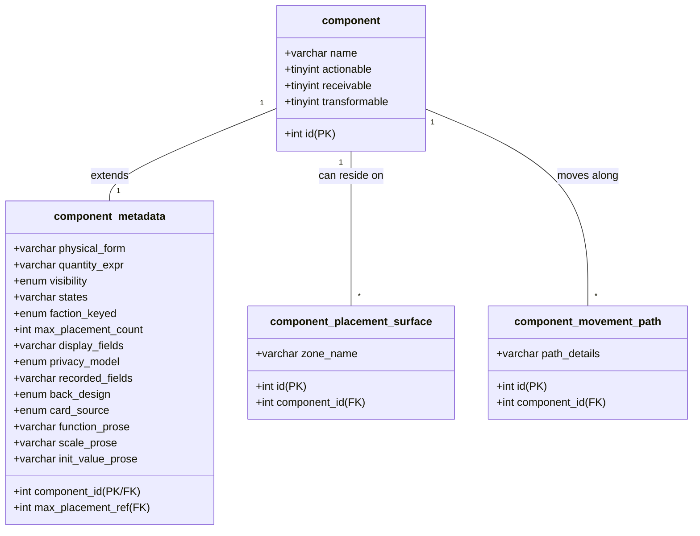

# THE SIGNAL — component_metadata & Database Roadmap Strategy

This report outlines the design strategy for translating the newly signed-off **Art 02 (Components v2.0)** metadata schemas into the database via a new `component_metadata` architecture, and maps out a sequence for resolving the pending database entities from **Art 00b (Analysis Readiness)**.

---

## 1. component_metadata Table Design

Art 02 §4.1 establishes a **Universal Component Schema** comprising 11 universal fields and 9 group-specific fields. 

Because the database currently registers exactly 70 components and is unlikely to exceed 150 components for the core game, we must weigh structural elegance against query simplicity. We propose two design options for the metadata layer.

### Option A: Hybrid Wide Table (Recommended)
A single `component_metadata` table containing all universal and group-specific fields (nullable), paired with two normalized junction tables for the complex relationship fields (`placement_surface` and `movement_path`).



#### Option A DDL Specifications
```sql
-- Main metadata extension table (1-to-1 with component)
CREATE TABLE component_metadata (
  component_id INT NOT NULL,
  physical_form VARCHAR(255) NOT NULL,
  quantity_expr VARCHAR(100) NOT NULL, -- Handles expressions like "1 per faction x 5 = 5"
  visibility ENUM('Public', 'Player-private', 'ARBITER-only', 'Variable') NOT NULL,
  states VARCHAR(255) DEFAULT NULL, -- NULL if single-state (N/A)
  faction_keyed ENUM('Yes', 'No', 'N/A') NOT NULL DEFAULT 'N/A',
  max_placement_count INT DEFAULT NULL, -- NULL if unbounded
  max_placement_ref INT DEFAULT NULL, -- FK to component.id; NULL if unbounded
  
  -- Group-Specific: Playing Surface
  privacy_model ENUM('Open', 'Faction-private', 'ARBITER-private') DEFAULT NULL,
  
  -- Group-Specific: Cards & Playing Surfaces
  display_fields VARCHAR(255) DEFAULT NULL,
  
  -- Group-Specific: Card Systems
  back_design ENUM('Faction-keyed', 'Neutral', 'ARBITER-keyed') DEFAULT NULL,
  card_source ENUM('Deck', 'Hand', 'ARBITER supply', 'Sealed') DEFAULT NULL,
  
  -- Group-Specific: Intel
  recorded_fields VARCHAR(255) DEFAULT NULL,
  
  -- Group-Specific: Resolution & Tracking Tools
  function_prose VARCHAR(255) DEFAULT NULL,
  scale_prose VARCHAR(255) DEFAULT NULL,
  init_value_prose VARCHAR(100) DEFAULT NULL,
  
  PRIMARY KEY (component_id),
  CONSTRAINT fk_metadata_component FOREIGN KEY (component_id) 
    REFERENCES component (id) ON DELETE CASCADE,
  CONSTRAINT fk_metadata_max_ref FOREIGN KEY (max_placement_ref) 
    REFERENCES component (id) ON DELETE SET NULL
);

-- Normalized junction table for placement_surface (handles multiple semicolon-separated zones)
CREATE TABLE component_placement_surface (
  id INT NOT NULL AUTO_INCREMENT,
  component_id INT NOT NULL,
  zone_name VARCHAR(100) NOT NULL,
  PRIMARY KEY (id),
  CONSTRAINT fk_placement_component FOREIGN KEY (component_id) 
    REFERENCES component (id) ON DELETE CASCADE
);

-- Normalized junction table for movement_path (handles complex movement steps and triggers)
CREATE TABLE component_movement_path (
  id INT NOT NULL AUTO_INCREMENT,
  component_id INT NOT NULL,
  path_details VARCHAR(255) NOT NULL, -- Format: "from -> to : trigger"
  PRIMARY KEY (id),
  CONSTRAINT fk_movement_component FOREIGN KEY (component_id) 
    REFERENCES component (id) ON DELETE CASCADE
);
```

### Option B: Strictly Normalized Aspect Tables
A strict 3NF design where metadata is split into specialized "aspect" tables corresponding to the component groups. Components only have rows in the aspect tables that apply to them.

* **`component_metadata`:** universal columns only.
* **`component_aspect_surface`:** `privacy_model`, `display_fields`.
* **`component_aspect_card`:** `back_design`, `card_source`, `display_fields`.
* **`component_aspect_intel`:** `recorded_fields`.
* **`component_aspect_instrument`:** `function_prose`, `scale_prose`, `init_value_prose`.

#### Rationale for Option A
Option A is highly recommended. Because the total dataset is tiny, querying a single table for component properties is much simpler and prevents complex query logic. The database views can easily partition the columns based on type or return clean `COALESCE` statements. The two separate junction tables are sufficient to normalize the only many-to-many properties (`placement_surface` and `movement_path`).

---

## 2. Database Roadmap & Punchlist (from Art 00b)

Art 00b §5 identifies several lookup tables and entities pending migration. We classify these into immediate, intermediate, and blocked categories.

```
┌────────────────────────────────────────────────────────┐
│               DATABASE MIGRATION ROADMAP               │
├───────────────────────────┬────────────────────────────┤
│ Phase 1: Lookup Tables    │ Phase 2: Slip & Marker DDL │
│ • public_standing_tier    │ • visibility_marker        │
│ • difficulty_tier         │ • boost_marker             │
│ • resolution_outcome      │ • notification_slip        │
│ • influence_level         │ • intel_delivery_slip      │
└─────────────┬─────────────┴─────────────┬──────────────┘
              │                           │
              ▼                           ▼
┌────────────────────────────────────────────────────────┐
│ Phase 3: Design-Gated (Stubs)                          │
│ • portrait_band (ranges TBD in Art 07)                 │
│ • operative (system pending Art 05)                    │
│ • modifier_card / event_card / countermeasure_card     │
└────────────────────────────────────────────────┘
```

### Phase 1: Static Lookup Tables (Ready for Migration)
These tables represent core rules metrics that are fully finalized in the design docs and can be migrated immediately.

1. **`public_standing_tier` (PS-xx):**
   * Fields: `id INT PK`, `name VARCHAR`, `range_min TINYINT`, `range_max TINYINT`, `drift_delta TINYINT`
   * Seeding values: Celebrated (17–20, −1), Respected (13–16, −1), Neutral (7–12, 0), Suspect (3–6, +1), Discredited (0–2, +1).
2. **`difficulty_tier` (DT-xx):**
   * Fields: `id INT PK`, `name VARCHAR`, `base_threshold TINYINT`
   * Seeding values: Easy (75), Average (50), Challenging (25).
3. **`resolution_outcome` (RO-xx):**
   * Fields: `id INT PK`, `name VARCHAR`, `trigger_condition VARCHAR`
   * Seeding values: Succeeded, Failed, Voided, Discovered, Auto-failed.
4. **`influence_level` (IL-xx):**
   * Fields: `id INT PK`, `name VARCHAR`, `chip_threshold TINYINT`
   * Seeding values: Dominant (3), Established (2), Present (1), None (0).

### Phase 2: Game Slips & Physical Markers (Pending DDL)
These are physical game elements that have defined metadata and can be added to the registry and schema once metadata schemas are approved.

1. **`visibility_marker` & `boost_marker`:** Add DDL table schemas and registers.
2. **`notification_slip` & `intel_delivery_slip`:** Add tables to support recorded/written fields.

### Phase 3: Design-Gated Tables (Stubs Only)
These tables are waiting on downstream design documents and should remain as design stubs for now:

1. **`portrait_band` (PB-xx):** Blocked pending score ranges from Art 07 Portrait design.
2. **`operative` (O-xx):** Blocked pending Art 05 design pass.
3. **`modifier_card` (MC-xx) & `event_card` (EC-xx) & `countermeasure_card` (CC-xx):** Blocked pending card set designs.

---

## 3. Decisions Made (S98) — Andy + Claude

**Metadata architecture: Option A confirmed (L130).** `component_metadata` as a single hybrid wide table — no junction tables.

**`component_movement_path` dropped.** Movement path entries in Art 02 carry procedural context from Art 03 — this belongs in artifact prose, not in the DB. The DB does not model procedures.

**`component_placement_surface` dropped.** `subject_target` is already the authoritative record of all valid placement/movement targets for each component. 34 subject_target rows were inserted S98 (see DB-41, DB-42 in PM05). No redundant junction table needed.

**`trigger` is a reserved word in MariaDB.** Avoid it in all column and table names in any DDL.

**DB state after S98:** 77 components registered, max id=119 (d10 added S98), AUTO_INCREMENT=120. Flag corrections applied to ~20 components. Schema reference updated.

## 4. Next Steps

1. **DB-42:** Create `component_metadata` DDL (Option A, no junction tables) + Python seeder from Art 02 §4.1 metadata blocks. Gate: 02-n26 re-sign-off.
2. **DB-43:** Execute Phase 1 static lookup table DDL + seeding (`public_standing_tier`, `difficulty_tier`, `resolution_outcome`, `influence_level`). No gate — design-ready now.
3. **DB-41:** Seed `comp_verb_phase` and `comp_verb_role` for S98 verb additions (d10, Modifier token Flip, container Reveal/Conceal, Threshold Slider Corrupt). Gate: 02-n26 re-sign-off.
4. **DB-37 (revised):** After DB-42 seeded, create derived views from `component_metadata` + `subject_target`. Drop views originally scoped to movement_path data.
