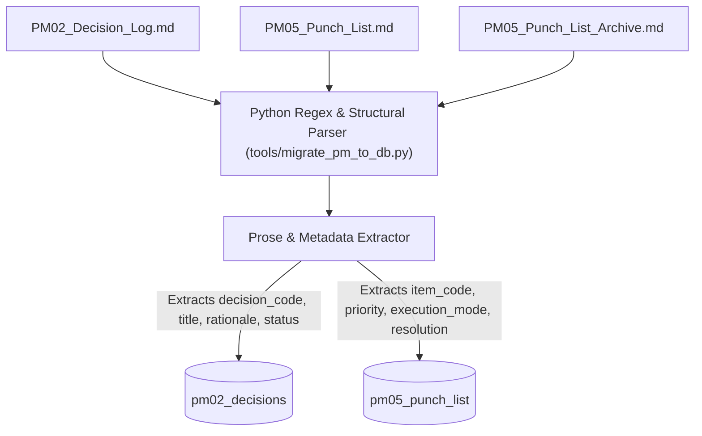

# Staged Proposal: Database Migration for PM02 (Decisions) & PM05 (Punch List)

**Status**: **Staged Draft — Pending User Review & Dual-Authorization Execution**  
**Authors**: `lev` & `Andy`  
**Target Database**: `the_signal_db` on **`dot`** (`10.0.0.14`)  

---

## Executive Summary

To eliminate markdown file bloat, reduce token consumption across agent sessions, eliminate concurrent edit collisions, and enable sub-second task filtering, this proposal migrates **PM02 (Decision Log)** and **PM05 (Punch List)** from static Markdown documents into structured MariaDB tables inside `the_signal_db`.

A Python parser script (`tools/migrate_pm_to_db.py`) will parse existing prose, historical archives, and markdown tables into normalized SQL records, extracting buried metadata (status, rationale, alternatives, dependencies, and execution modes).

---

## 1. DDL Schemas

### A. Decision Log Table (`pm02_decisions`)

```sql
CREATE TABLE IF NOT EXISTS `pm02_decisions` (
  `id` INT AUTO_INCREMENT PRIMARY KEY,
  `decision_code` VARCHAR(20) NOT NULL UNIQUE,          -- e.g. 'L01', 'L321'
  `title` VARCHAR(255) NOT NULL,
  `category` VARCHAR(50) NOT NULL DEFAULT 'General',    -- 'Architecture', 'Database', 'Gameplay', 'Network'
  `status` ENUM('active', 'superseded', 'retired', 'draft') DEFAULT 'active',
  `superseded_by_code` VARCHAR(20) DEFAULT NULL,      -- Foreign reference to newer decision code
  `artifact_ref` VARCHAR(100) DEFAULT NULL,           -- Target doc/spec (e.g. 'Art 04 §6', '00b Data Arch')
  `decision` TEXT NOT NULL,                           -- Core decision statement
  `rationale` TEXT DEFAULT NULL,                      -- Why this choice was made
  `alternatives_considered` TEXT DEFAULT NULL,        -- Options evaluated and rejected
  `impact_level` ENUM('minor', 'moderate', 'major', 'architectural') DEFAULT 'moderate',
  `author` VARCHAR(50) NOT NULL DEFAULT 'Andy',       -- 'Andy', 'Claude', 'lev', 'agy'
  `session_num` INT DEFAULT NULL,                     -- Session number where decision was logged
  `created_at` TIMESTAMP DEFAULT CURRENT_TIMESTAMP,
  `updated_at` TIMESTAMP DEFAULT CURRENT_TIMESTAMP ON UPDATE CURRENT_TIMESTAMP
) ENGINE=InnoDB DEFAULT CHARSET=utf8mb4 COLLATE=utf8mb4_general_ci;
```

### B. Punch List / Action Item Table (`pm05_punch_list`)

```sql
CREATE TABLE IF NOT EXISTS `pm05_punch_list` (
  `id` INT AUTO_INCREMENT PRIMARY KEY,
  `item_code` VARCHAR(20) NOT NULL UNIQUE,             -- e.g. 'P29', 'DB-08', 'SYS-14'
  `title` VARCHAR(255) NOT NULL,
  `category` VARCHAR(50) NOT NULL DEFAULT 'General',    -- 'Schema', 'Wiki', 'Network', 'Hardware'
  `priority` ENUM('P0_critical', 'P1_high', 'P2_medium', 'P3_low') DEFAULT 'P2_medium',
  `status` ENUM('open', 'in_progress', 'blocked', 'closed', 'cancelled') DEFAULT 'open',
  
  -- Execution Dispatch Mode
  `execution_mode` ENUM('autonomous', 'interactive', 'hybrid') DEFAULT 'interactive',
  
  `depends_on_item_code` VARCHAR(20) DEFAULT NULL,     -- Prerequisite task code
  `target_milestone` VARCHAR(50) DEFAULT NULL,        -- Milestone/Phase (e.g. 'Phase 3 Network', 'v1.0')
  `complexity_estimate` ENUM('XS', 'S', 'M', 'L', 'XL') DEFAULT 'M',
  `description` TEXT DEFAULT NULL,                    -- Requirements & Context
  `resolution_notes` TEXT DEFAULT NULL,               -- Solution KB (how it was fixed)
  `assigned_agent` VARCHAR(50) DEFAULT NULL,           -- 'lev', 'agy', 'Claude'
  `verified_by` VARCHAR(50) DEFAULT NULL,              -- Sign-off ('Andy', 'lev')
  `session_logged` INT DEFAULT NULL,
  `session_closed` INT DEFAULT NULL,
  `created_at` TIMESTAMP DEFAULT CURRENT_TIMESTAMP,
  `updated_at` TIMESTAMP DEFAULT CURRENT_TIMESTAMP ON UPDATE CURRENT_TIMESTAMP
) ENGINE=InnoDB DEFAULT CHARSET=utf8mb4 COLLATE=utf8mb4_general_ci;
```

---

## 2. Migration Plan & Prose Parsing Strategy

The migration will process 3 primary source documents:
1. `PM02_Decision_Log.md` (Live decision log: L01–L140+)
2. `PM05_Punch_List.md` (Active work items)
3. `PM05_Punch_List_Archive.md` (Historical closed items)

### Migration Pipeline (`tools/migrate_pm_to_db.py`):



### Parsing Rules & Field Extraction:

| Target Column | Extraction Rule / Heuristic from Markdown Prose |
| :--- | :--- |
| **`decision_code` / `item_code`** | Regex matching `L[0-9]+` (e.g., `L108`) or `P[0-9]+` / `DB-[0-9]+` / `SYS-[0-9]+`. |
| **`title`** | Text following code heading (e.g. `### L108: Component Junction Table Normalization`). |
| **`status` (PM02)** | Marked `active` by default. Set to `superseded` if prose explicitly states *"Superseded by LX"* or `retired` if marked obsolete. |
| **`superseded_by_code`** | Extracted via regex `[Ss]uperseded by (L[0-9]+)`. |
| **`rationale`** | Paragraph text following headers like *"Rationale:"*, *"Context:"*, or *"Why:"*. |
| **`alternatives_considered`** | Paragraph text following *"Options evaluated:"* or *"Alternative:"*. |
| **`execution_mode` (PM05)** | Inferred from task nature: <br>• `autonomous`: `build_wiki.py`, backup scripts, SQL DDL migrations, linting. <br>• `interactive`: sound tuning, Wi-Fi monitor setup, `/grill-me`, game balance. <br>• `hybrid`: draft proposals, staging reviews. |
| **`resolution_notes`** | Paragraphs detailing closed fixes in `PM05_Punch_List_Archive.md`. |

---

## 3. Workflow Integration & CLI Exporter

### A. Sub-Second Agent Queries (Low Token Overhead)
* **Interactive Session Agenda**:
  ```sql
  SELECT item_code, title, priority, complexity_estimate 
  FROM pm05_punch_list 
  WHERE status = 'open' AND execution_mode = 'interactive' 
  ORDER BY priority ASC;
  ```
* **Background Work Queue**:
  ```sql
  SELECT item_code, title, assigned_agent 
  FROM pm05_punch_list 
  WHERE status = 'open' AND execution_mode = 'autonomous' AND depends_on_item_code IS NULL;
  ```

### B. Automatic Markdown View Exporter (`tools/export_pm_docs.py`)
To maintain backwards compatibility for git commits and human viewing in VS Code/MkDocs:
* A lightweight Python script regenerates clean `PM02_Decision_Log.md` and `PM05_Punch_List.md` markdown files on demand directly from MariaDB tables.

---

## 4. Execution Steps (When Approved)

1. **Step 1**: Create `pm02_decisions` and `pm05_punch_list` tables on **`dot`** (`10.0.0.14`).
2. **Step 2**: Run `tools/migrate_pm_to_db.py` to populate tables from live and archived markdown files.
3. **Step 3**: Verify row counts and audit extracted metadata.
4. **Step 4**: Deploy `tools/export_pm_docs.py` helper script.
